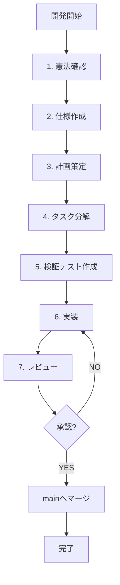
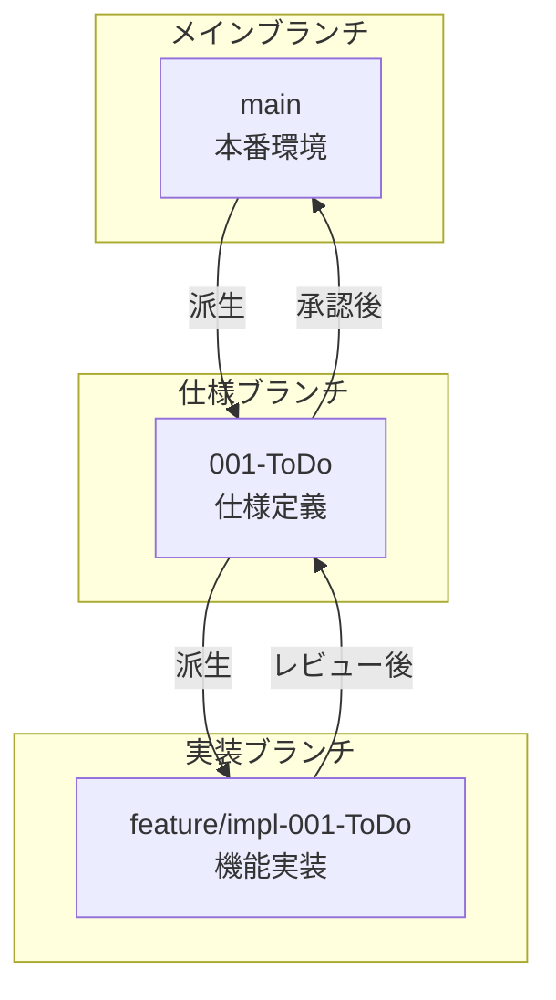

# Todo App プロジェクト憲法

**プロジェクト名**: Todo App
**憲法バージョン**: 1.0.0
**批准日**: 2025-11-20

---

## 中核原則

### I. テスト駆動開発（必須・非交渉）

**原則**:

- すべての機能実装前にテストを作成しなければならない（MUST）
- テストが失敗することを確認してから実装を開始しなければならない（MUST）
- Red-Green-Refactorサイクルを厳格に遵守しなければならない（MUST）
- 仕様に対する検証テストを必須とする（MUST）
- テストカバレッジは100%を目標とする（SHOULD）

**根拠**:
テスト駆動開発は、コードの品質を保証し、仕様との整合性を確保する最も効果的な手段である。事前にテストを書くことで、要件を明確化し、実装の方向性を定め、リグレッションを防止する。

### II. セキュリティファースト

**原則**:

- セキュリティ要件は機能要件より優先しなければならない（MUST）
- 機密データの平文保存を禁止する（MUST）
- すべての機密データは暗号化またはハッシュ化しなければならない（MUST）
- セキュリティレビューなしに機密データを扱う機能をデプロイしてはならない（MUST NOT）

**根拠**:
セキュリティは後から追加できるものではなく、設計段階から組み込むべき要件である。データ漏洩やセキュリティ侵害は、ユーザーの信頼を失い、プロジェクト全体の信用を損なう。機密データの適切な取り扱いは、プライバシー保護とコンプライアンス遵守の基盤となる。

### III. パフォーマンス基準の定量化

**原則**:

- すべてのパフォーマンス要件を定量的な閾値で定義しなければならない（MUST）
- パフォーマンス閾値を受入基準に組み込まなければならない（MUST）
- レスポンスタイム、メモリ使用量、処理速度などの具体的な数値を設定しなければならない（MUST）
- パフォーマンステストを継続的に実行し、閾値を超えた場合は是正しなければならない（MUST）

**根拠**:
「速い」「軽い」といった主観的な表現では、品質を測定できない。定量的な基準を設けることで、パフォーマンスの劣化を客観的に検知し、ユーザー体験の一貫性を保証できる。

### IV. ユーザー体験の一貫性

**原則**:

- UIコンポーネントは再利用可能な形で設計しなければならない（MUST）
- デザインシステムまたはコンポーネントライブラリに従わなければならない（MUST）
- アクセシビリティ基準（ARIA属性、キーボード操作等）を満たさなければならない（MUST）
- レスポンシブデザインを実装し、複数デバイスでの動作を保証しなければならない（MUST）

**根拠**:
一貫したユーザー体験は、アプリケーションの使いやすさと学習容易性を向上させる。再利用可能なコンポーネントは、開発効率を高め、保守性を改善する。アクセシビリティは、すべてのユーザーが平等にアプリケーションを利用できる権利を保証する。

### V. コード品質と可読性

**原則**:

- コードレビューを経ずにmainブランチへのマージを禁止する（MUST NOT）
- リンター・フォーマッターの警告を解決せずにコミットしてはならない（MUST NOT）
- 型安全性を確保し、TypeScriptの厳格モードを使用しなければならない（MUST）
- 複雑な処理には適切なコメントとドキュメントを追加しなければならない（MUST）

**根拠**:
高品質なコードは、バグを減らし、保守性を向上させ、チーム全体の生産性を高める。型安全性は、実行時エラーを事前に検出し、リファクタリングを安全にする。コードレビューは、知識共有と品質向上の機会を提供する。

## 制約事項

### 外部依存管理

**制約**:

- すべての外部依存はバージョンを固定しなければならない（MUST）
- `package.json`で曖昧なバージョン指定（`^`, `~`）を使用してはならない（MUST NOT）
- 依存関係の更新は、テストの成功を確認してからコミットしなければならない（MUST）

**根拠**:
バージョン固定により、ビルドの再現性を確保し、予期しない依存関係の更新による障害を防止する。

### 仕様と実装の整合性

**制約**:

- 仕様書に記載されていない機能を実装してはならない（MUST NOT）
- 仕様と実装の乖離をコードレビューで検知し是正しなければならない（MUST）
- 仕様変更は、仕様書を更新してから実装を変更しなければならない（MUST）

**根拠**:
仕様書は単一の真実の情報源（Single Source of Truth）である。仕様と実装の乖離は、混乱を招き、保守性を低下させる。

### データ永続化

**制約**:

- データの永続化にはLocalStorage APIを使用しなければならない（MUST）
- ページごとにデータを分離して保存しなければならない（MUST）
- データの読み書きにはユーティリティ関数を使用し、直接LocalStorageを操作してはならない（MUST NOT）

**根拠**:
一貫したデータアクセスパターンは、バグを減らし、将来的なストレージ変更を容易にする。

## ガバナンス

### 開発ワークフロー

**手順**:



**作業順序**:

1. 憲法の確認と遵守確認
2. 仕様書の作成または更新
3. 実装計画の策定
4. タスクへの分解
5. 検証テストの作成
6. 実装
7. コードレビュー

この順序を逆転してはならない（MUST NOT）。

### ブランチ戦略

**ブランチモデル**:



**ブランチ作成手順**:

**仕様ブランチ**（mainブランチから派生）:

```powershell
git checkout main
git checkout -b 001-<トピック短縮名>
```

**実装ブランチ**（仕様ブランチから派生）:

```powershell
git checkout 001-<トピック名>
git checkout -b feature/impl-001-<機能短縮名>
```

**命名規則**:

- 仕様ブランチ: `<番号>-<短い名前>` （例: `001-ToDo`）
- 実装ブランチ: `feature/impl-<番号>-<短い名前>` （例: `feature/impl-001-ToDo`）

### レビューと承認

**必須レビュー項目**:

- 憲法原則への準拠
- テストカバレッジ（目標: 100%）
- セキュリティ要件の充足
- パフォーマンス閾値の達成
- コード品質（型安全性、可読性）

**承認基準**:

- すべてのテストが成功していること
- リンター・フォーマッターの警告がゼロであること
- レビュアーの承認を得ていること
- 仕様書との整合性が確認されていること

**重大変更の定義**:
以下の変更は、必ずレビュー承認を得なければならない（MUST）:

- 外部APIの追加または変更
- データモデルの変更
- セキュリティに関わる変更
- パフォーマンスに影響する変更
- ユーザーインターフェースの重大な変更

### 開発方針

**同時起動サポート**:

- フロントエンドとバックエンドを同時に起動するスクリプトを提供しなければならない（MUST）
- ワンコマンドでの開発環境セットアップを可能にしなければならない（MUST）
- `start.ps1`スクリプトによる自動化を維持しなければならない（MUST）

**検証と修正**:

- 正常に動作するまで繰り返し検証しなければならない（MUST）
- エラー修正を中途半端な状態で終了してはならない（MUST NOT）
- すべての機能が仕様通りに動作することを確認してからブランチをマージしなければならない（MUST）

**ドキュメント化**:

- 複雑なロジックにはフローチャートやシーケンス図（Mermaid）を挿入しなければならない（MUST）
- Mermaid v11の構文に準拠しなければならない（MUST）
- 図の構文エラーを修正してからコミットしなければならない（MUST）

**Mermaid v11 ベストプラクティス**:

1. **gitGraph使用時の注意**:

   - 日本語を避けるか、flowchart/graph形式を使用すること
   - `tag:`構文は非推奨、代わりにノードで表現すること
2. **日本語対応**:

   - flowchart、graph、sequenceDiagramは日本語完全対応
   - ノードラベル、エッジラベル、Noteで日本語使用可能
3. **推奨構文**:

   - ブランチ戦略: `flowchart TB` + `subgraph`
   - プロセスフロー: `flowchart TD/LR`
   - 時系列: `sequenceDiagram`
   - 状態遷移: `stateDiagram-v2`

### 憲法の改訂

**改訂手順**:

1. 改訂提案の文書化
2. 影響範囲の分析
3. 移行計画の策定
4. レビューと承認
5. バージョン番号の更新
6. 関連ドキュメントの更新

**バージョニング規則**:

- **MAJOR**: 後方互換性のない原則の削除または再定義
- **MINOR**: 新しい原則・セクションの追加、または重大な拡張
- **PATCH**: 明確化、表現の改善、誤字修正、非意味的な改良

**遵守の検証**:

- すべてのプルリクエストで憲法への準拠を検証しなければならない（MUST）
- 四半期ごとに憲法遵守状況をレビューすべきである（SHOULD）
- 憲法違反を発見した場合は、速やかに是正しなければならない（MUST）

### テンプレートとの整合性

**テンプレートファイル**:

- `.specify/templates/spec-template.md` - 仕様書テンプレート
- `.specify/templates/plan-template.md` - 計画テンプレート
- `.specify/templates/tasks-template.md` - タスクテンプレート
- `.specify/templates/checklist-template.md` - チェックリストテンプレート

**整合性チェック**:

- テンプレートの「Constitution Check」セクションは、本憲法の原則を反映しなければならない（MUST）
- 憲法改訂時は、すべてのテンプレートを更新しなければならない（MUST）
- 新しい原則追加時は、関連するタスクカテゴリをタスクテンプレートに追加しなければならない（MUST）

## 品質保証

### トークン効率と完全性

**原則**:

- ワークスペース内の全ファイルを末尾まで解析しなければならない（MUST）
- トークン制限まで中断せずすべてのタスクを実行しなければならない（MUST）
- トークン制限を理由に簡略化や品質低下を行ってはならない（MUST NOT）
- トークン制限まで、生成したドキュメントを繰り返しブラッシュアップしなければならない（MUST）

**根拠**:
完全で高品質なドキュメントは、プロジェクトの成功に不可欠である。中途半端な成果物は、後続作業の障害となり、全体の生産性を低下させる。

### 文字エンコーディング

**原則**:

- すべてのファイルはUTF-8エンコーディングで保存しなければならない（MUST）
- 文字化け防止のため、BOM（Byte Order Mark）なしのUTF-8を使用しなければならない（MUST）

**根拠**:
UTF-8は国際標準であり、日本語を含むすべての言語を適切に表現できる。一貫したエンコーディングは、文字化けを防止し、クロスプラットフォーム互換性を保証する。

### テンプレートのローカライゼーション

**原則**:

- テンプレートから生成したドキュメントの英語部分を確実に削除しなければならない（MUST）
- すべてのドキュメントは日本語で記述しなければならない（MUST）
- コメントやプレースホルダーを残してはならない（MUST NOT）

**根拠**:
プロジェクトの主言語は日本語である。混在した言語は読みにくく、理解を妨げる。完全に日本語化されたドキュメントは、すべてのチームメンバーが容易に理解できる。

---
