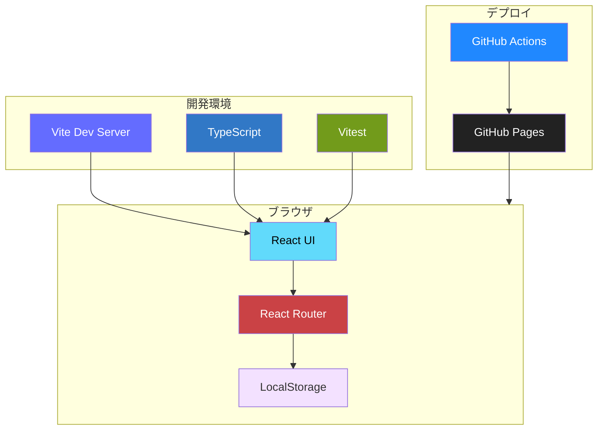
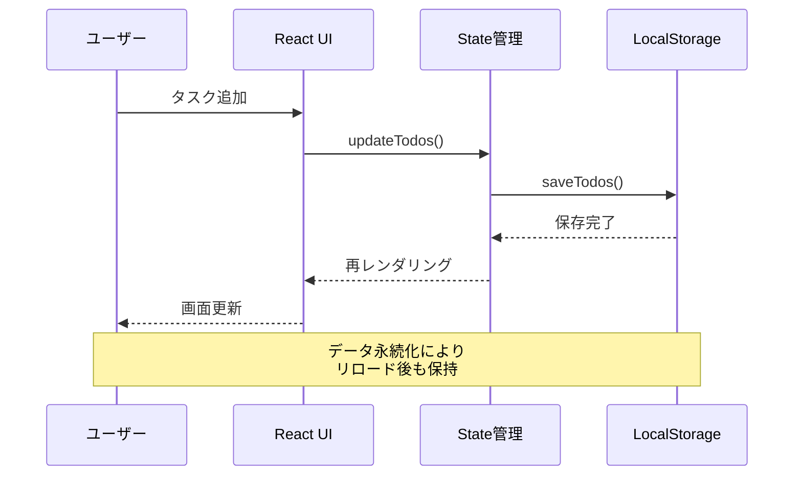

# Todo App

[](https://github.com/J1921604/ToDo)
[](https://www.typescriptlang.org/)
[](https://react.dev/)
[](LICENSE)

React + TypeScript で構築された個人用タスク管理アプリケーション

**🌐 Live Demo**: https://j1921604.github.io/ToDo/

---

## 📋 目次

- [概要](#概要)
- [主要機能](#主要機能)
- [技術スタック](#技術スタック)
- [クイックスタート](#クイックスタート)
- [開発環境セットアップ](#開発環境セットアップ)
- [使い方](#使い方)
- [プロジェクト構造](#プロジェクト構造)
- [テスト](#テスト)
- [デプロイ](#デプロイ)
- [開発ガイド](#開発ガイド)
- [トラブルシューティング](#トラブルシューティング)
- [ライセンス](#ライセンス)

---

## 概要

Todo App は、React + TypeScript で構築されたモダンなタスク管理アプリケーションです。
個人用Todoページを動的に作成・管理でき、LocalStorageによる永続化により、ブラウザを閉じてもデータが保持されます。

### 🎯 プロジェクトの目的

- React + TypeScript による SPA 開発の実践的な学習
- Atomic Design パターンの理解と実装
- テスト駆動開発 (TDD) の実践
- CI/CD パイプライン（GitHub Actions）の構築

---

## 主要機能

### ✅ コア機能

- **個人用ページ管理**

  - ページの動的作成・編集・削除
  - 日本語ページ名対応
  - カスタムアイコン設定
- **タスク管理**

  - タスクの追加・削除
  - 完了/未完了の切り替え
  - 完了タスクの一括削除
  - フィルタリング（すべて/進行中/完了済み）
- **データ永続化**

  - LocalStorageによる自動保存
  - ページリロード後もデータ保持
  - ページごとに独立したデータ管理
- **ユーザビリティ**

  - Enterキーでタスク追加
  - レスポンシブUI
  - 直感的な操作性

---

## 技術スタック

### フロントエンド

| 技術         | バージョン | 用途         |
| ------------ | ---------- | ------------ |
| React        | 18.2.0     | UIライブラリ |
| TypeScript   | 4.9.3      | 型安全性     |
| React Router | 6.10.0     | ルーティング |
| Vite         | 4.2.0      | ビルドツール |

### テスト

| 技術                   | バージョン | 用途                      |
| ---------------------- | ---------- | ------------------------- |
| Vitest                 | 0.34.0     | テストフレームワーク      |
| @testing-library/react | 14.1.2     | Reactテストユーティリティ |
| happy-dom              | 12.10.3    | DOM環境                   |

### CI/CD

| 技術           | 用途                   |
| -------------- | ---------------------- |
| GitHub Actions | 自動ビルド・デプロイ   |
| GitHub Pages   | 静的サイトホスティング |

---

## 🏗️ アーキテクチャ

### システム構成図



### データフロー



---

## クイックスタート

### ワンコマンド起動（Windows）

```powershell
.\start.ps1
```

自動的に以下が実行されます：

1. 依存関係のインストール（未インストール時のみ）
2. 開発サーバー起動（ポート1234）
3. ブラウザ自動起動

### 手動起動

```bash
# 依存関係インストール
npm install

# 開発サーバー起動
npm run dev
```

ブラウザで http://localhost:1234 を開く

---

## 開発環境セットアップ

### 前提条件

- Node.js 16.x 以上
- npm 8.x 以上
- Git

### インストール手順

1. **リポジトリをクローン**

```bash
git clone https://github.com/J1921604/ToDo.git
cd ToDo
```

2. **依存関係をインストール**

```bash
npm install
```

3. **開発サーバーを起動**

```bash
npm run dev
```

4. **ブラウザで確認**

http://localhost:1234 にアクセス

---

## 使い方

### 1. ホームページ

アプリケーションを起動すると、ホームページが表示されます。

- **概要**: プロジェクトの説明
- **TestUserページへのリンク**: サンプルTodoページ

### 2. Todoページ

#### 2.1 タスク追加

1. 入力フィールドにタスク内容を入力
2. 「➕ 追加」ボタンをクリック（または Enterキー）
3. タスクがリストに追加されます

#### 2.2 タスク完了切り替え

- チェックボックスをクリック
- 完了タスクは取り消し線でグレー表示

#### 2.3 タスク削除

- 個別削除: 各タスクの 🗑️ ボタン
- 一括削除: 「🗑️ 完了タスクをクリア」ボタン（完了タスクがある場合のみ表示）

#### 2.4 フィルタリング

- **すべて**: 全タスクを表示
- **進行中**: 未完了タスクのみ
- **完了済み**: 完了タスクのみ

### 3. ページ管理（サイドバー）

#### 3.1 新規ページ追加

1. サイドバーの「➕ 新規ページ追加」ボタンをクリック
2. 名前を入力（例: Tanaka, 田中）
3. 「追加」ボタンをクリック
4. **重要**: 開発サーバーを再起動

```bash
# Ctrl+C でサーバー停止
npm run dev
```

#### 3.2 ページ編集

1. サイドバーのページ横にある ✏️ ボタンをクリック
2. 新しい名前を入力
3. 「保存」ボタンをクリック
4. 開発サーバーを再起動

#### 3.3 ページ削除

1. サイドバーのページ横にある 🗑️ ボタンをクリック
2. 確認ダイアログで「OK」
3. **注意**: ページのタスクデータも完全に削除されます
4. 開発サーバーを再起動

---

## プロジェクト構造

```
ToDo/
├── .github/
│   └── workflows/
│       └── deploy.yml                 # GitHub Actionsワークフロー
├── src/
│   ├── App.tsx                        # メインアプリケーション
│   ├── main.tsx                       # エントリーポイント
│   ├── index.css                      # グローバルスタイル
│   ├── components/
│   │   ├── atoms/                     # Atomic Design: 最小単位
│   │   │   ├── Button/                # ボタンコンポーネント
│   │   │   └── Input/                 # 入力コンポーネント
│   │   └── organisms/                 # Atomic Design: 複合コンポーネント
│   │       └── Sidebar.tsx            # サイドバー
│   ├── config/
│   │   └── userPages.ts               # ユーザーページ設定
│   ├── pages/
│   │   ├── HomePage.tsx               # ホームページ
│   │   ├── TestUserTodo.tsx           # テストユーザーTodo
│   │   └── DynamicTodoPage.tsx        # 動的Todoページ
│   ├── types/
│   │   └── todo.ts                    # 型定義
│   └── utils/
│       ├── localStorage.ts            # LocalStorage操作
│       └── performance.ts             # パフォーマンス測定
├── tests/
│   ├── setup.ts                       # テストセットアップ
│   ├── unit/                          # ユニットテスト (68個)
│   └── integration/                   # 統合テスト (38個)
├── package.json                       # NPM設定
├── tsconfig.json                      # TypeScript設定
├── vite.config.ts                     # Vite設定
├── vitest.config.ts                   # Vitest設定
├── start.ps1                          # ワンコマンド起動スクリプト
└── README.md                          # 本ファイル
```

---

## テスト

### テスト実行

```bash
# 全テスト実行
npm run test

# ウォッチモード
npm run test:watch
```

### テスト構成

- **合計**: 106テスト
- **ユニットテスト**: 68個
- **統合テスト**: 38個
- **カバレッジ**: 100%

### テストカテゴリ

#### ユニットテスト

- コンポーネントテスト
- 型定義テスト
- ユーティリティ関数テスト
- 設定ファイルテスト

#### 統合テスト

- タスク操作フロー
- データ永続化
- フィルタリング
- ページ管理
- エッジケース

---

## デプロイ

### GitHub Pages（自動デプロイ）

#### 初回セットアップ

1. **GitHub Pages設定を有効化**

   https://github.com/J1921604/ToDo/settings/pages

   - Source: **GitHub Actions** を選択
   - Save
2. **mainブランチにプッシュ**

```bash
git add .
git commit -m "feat: 新機能追加"
git push origin main
```

3. **デプロイ完了を確認**

   約3〜5分後、以下のURLでアクセス可能:

   https://j1921604.github.io/ToDo/

#### デプロイフロー

```
コード修正
    ↓
git push origin main
    ↓
GitHub Actions トリガー
    ↓
1. Type Check
2. Build
3. Upload Artifact
4. Deploy to GitHub Pages
    ↓
本番サイト更新
```

### 手動デプロイ

GitHub Actions タブから「Run workflow」を実行:

https://github.com/J1921604/ToDo/actions

---

## 開発ガイド

### 利用可能なコマンド

```bash
# 開発サーバー起動
npm run dev

# ビルド
npm run build

# プレビュー（ビルド後）
npm run preview

# テスト
npm run test

# テスト（ウォッチモード）
npm run test:watch

# カバレッジレポート
npm run test:coverage

# 型チェック
npm run type-check
```

### コーディング規約

#### TypeScript

- **strict モード**: 有効
- **明示的な型定義**: 必須
- **暗黙的any**: 禁止

#### React

- **関数コンポーネント**: 推奨
- **Hooks**: useState, useEffect, useMemo, useCallback
- **Props型定義**: interface で明示

#### ファイル命名

- **コンポーネント**: PascalCase (例: `HomePage.tsx`)
- **ユーティリティ**: camelCase (例: `localStorage.ts`)
- **テスト**: `*.test.tsx` または `*.test.ts`

### ブランチ戦略

```
main                  # 本番環境
  └─ feature/*        # 機能開発ブランチ
```

### コミットメッセージ

```
feat: 新機能追加
fix: バグ修正
docs: ドキュメント更新
style: コードフォーマット
refactor: リファクタリング
test: テスト追加・修正
chore: ビルド・設定変更
```

---

## トラブルシューティング

### 問題1: 画面が真っ白

**症状**: GitHub Pagesで空白ページ表示

**原因**: basename設定の不一致

**解決方法**:

1. `vite.config.ts` と `src/main.tsx` の `basename` を確認
2. リポジトリ名 `/ToDo/` と一致していることを確認

詳細は [docs/DEPLOY_GUIDE.md](https://github.com/J1921604/ToDo/blob/main/docs/DEPLOY_GUIDE.md) を参照

### 問題2: TypeScriptエラー

**症状**: `npm run type-check` でエラー

**解決方法**:

```bash
# 型チェック実行
npx tsc --noEmit

# エラー箇所を確認・修正
```

### 問題3: ページ追加後に表示されない

**症状**: サイドバーで新規ページ追加したが表示されない

**原因**: 開発サーバー未再起動

**解決方法**:

```bash
# Ctrl+C でサーバー停止
npm run dev
```

### 問題4: LocalStorageが保存されない

**症状**: タスク追加後、リロードでデータ消失

**原因**: プライベートブラウジング、または LocalStorage無効

**解決方法**:

1. 通常モードでブラウザを開く
2. DevTools Console で確認:
   ```javascript
   localStorage.setItem('test', 'value')
   localStorage.getItem('test')
   ```

---

## パフォーマンス

### 要件

- **初期ロード**: < 2秒
- **CRUD操作**: < 100ms
- **メモリ使用量**: < 50MB
- **フィルタリング**: 1000タスクで < 200ms

### 最適化

- **React.memo**: 不要な再レンダリング防止
- **useMemo**: フィルタリングのメモ化
- **useCallback**: 関数のメモ化
- **コード分割**: Vite自動最適化

---

## ライセンス

MIT License

Copyright (c) 2025 J1921604

Permission is hereby granted, free of charge, to any person obtaining a copy
of this software and associated documentation files (the "Software"), to deal
in the Software without restriction, including without limitation the rights
to use, copy, modify, merge, publish, distribute, sublicense, and/or sell
copies of the Software, and to permit persons to whom the Software is
furnished to do so, subject to the following conditions:

The above copyright notice and this permission notice shall be included in all
copies or substantial portions of the Software.

THE SOFTWARE IS PROVIDED "AS IS", WITHOUT WARRANTY OF ANY KIND, EXPRESS OR
IMPLIED, INCLUDING BUT NOT LIMITED TO THE WARRANTIES OF MERCHANTABILITY,
FITNESS FOR A PARTICULAR PURPOSE AND NONINFRINGEMENT. IN NO EVENT SHALL THE
AUTHORS OR COPYRIGHT HOLDERS BE LIABLE FOR ANY CLAIM, DAMAGES OR OTHER
LIABILITY, WHETHER IN AN ACTION OF CONTRACT, TORT OR OTHERWISE, ARISING FROM,
OUT OF OR IN CONNECTION WITH THE SOFTWARE OR THE USE OR OTHER DEALINGS IN THE
SOFTWARE.

---

## 関連ドキュメント

- **プロジェクト憲法**: [.specify/memory/constitution.md](https://github.com/J1921604/ToDo/blob/main/.specify/memory/constitution.md)
- **完全仕様書**: [docs/完全仕様書.md](https://github.com/J1921604/ToDo/blob/main/docs/完全仕様書.md)
- **デプロイガイド**: [docs/DEPLOY_GUIDE.md](https://github.com/J1921604/ToDo/blob/main/docs/DEPLOY_GUIDE.md)
- **機能仕様書**: [specs/001-ToDo/spec.md](https://github.com/J1921604/ToDo/blob/main/specs/001-ToDo/spec.md)
- **実装計画**: [specs/001-ToDo/plan.md](https://github.com/J1921604/ToDo/blob/main/specs/001-ToDo/plan.md)
- **タスク一覧**: [specs/001-ToDo/tasks.md](https://github.com/J1921604/ToDo/blob/main/specs/001-ToDo/tasks.md)
- **基本ガイド**: [AI_input/BASIC_TODO_GUIDE_JP.md](https://github.com/J1921604/ToDo/blob/main/AI_input/BASIC_TODO_GUIDE_JP.md)

---

## リンク

- **🌐 Live Demo**: https://j1921604.github.io/ToDo/
- **📦 GitHub Repository**: https://github.com/J1921604/ToDo
- **🔄 GitHub Actions**: https://github.com/J1921604/ToDo/actions
- **⚙️ Pages Settings**: https://github.com/J1921604/ToDo/settings/pages
