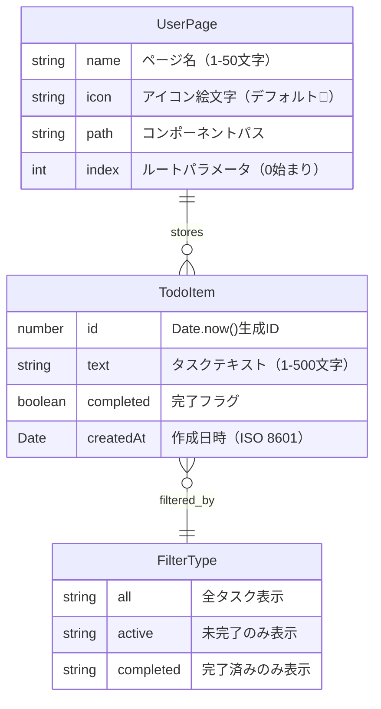
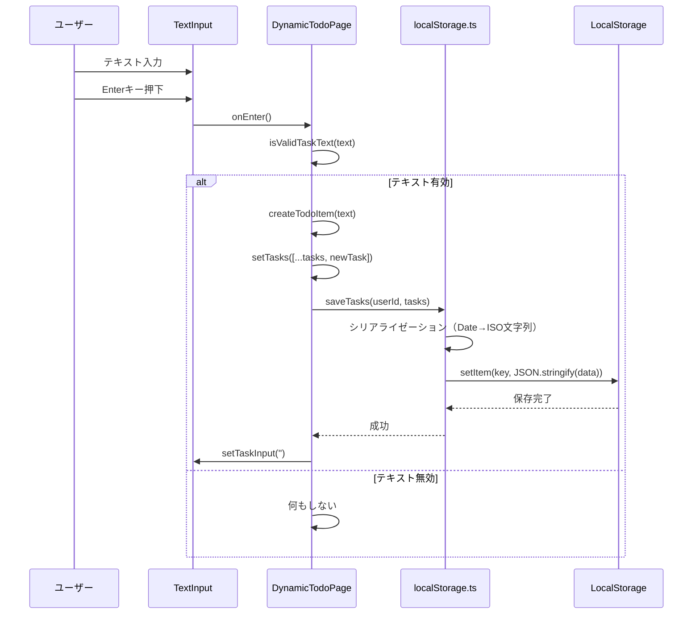
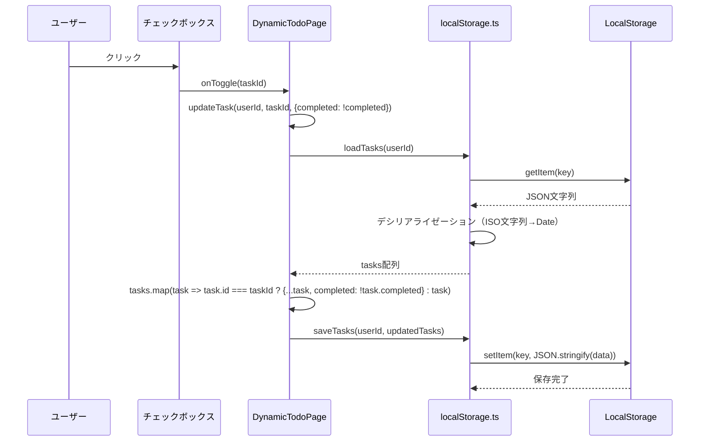
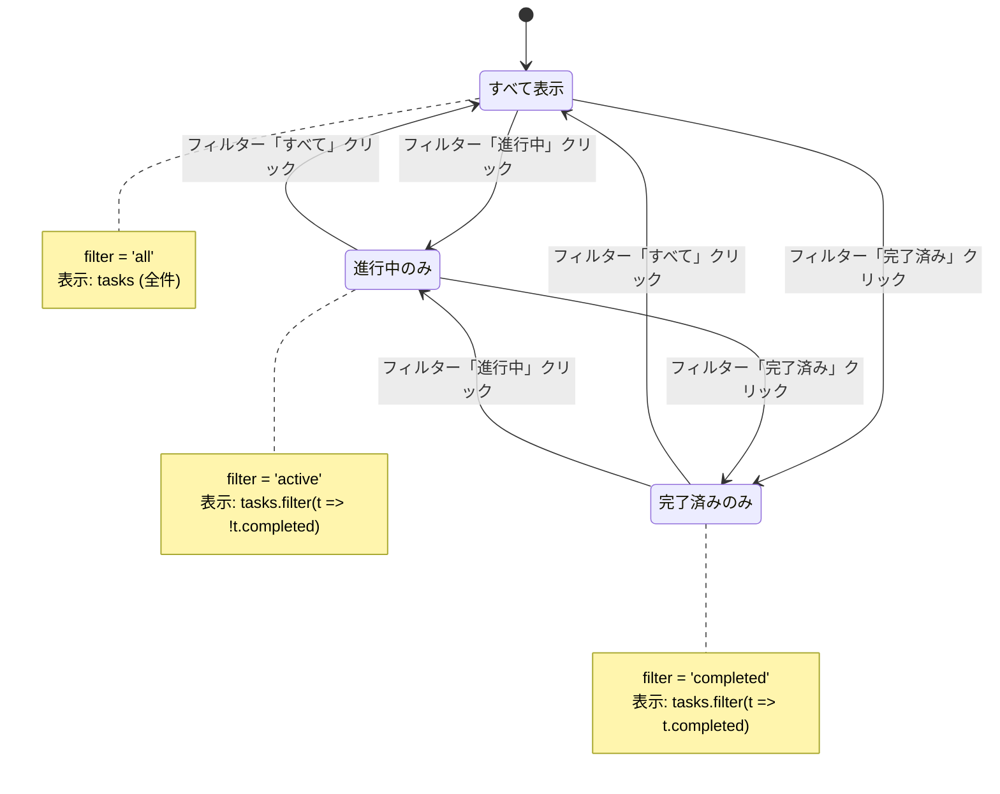
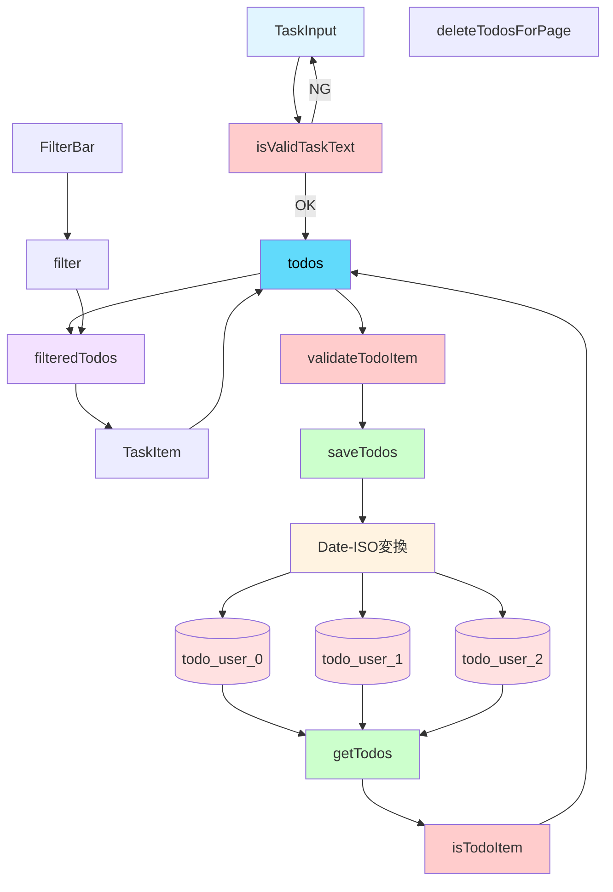
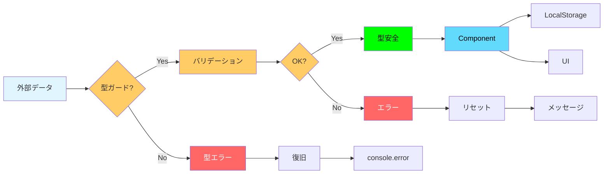

# Phase 1: データモデル設計

**機能**: 個人用Todoアプリケーション  
**ブランチ**: `feature/impl-001-ToDo`  
**作成日**: 2025-11-20  
**ステータス**: 完了

## 概要

本ドキュメントは、個人用Todoアプリケーションのデータモデル、型定義、バリデーションルール、コンポーネントインターフェースを詳細に定義します。すべての型はTypeScriptの厳格モード（strict: true）に準拠し、実行時エラーを最小限に抑えます。

**憲法準拠**: このドキュメントは、プロジェクト憲法v1.0.0のすべての原則に準拠しています。特に以下の原則を重視しています:
- **原則V コード品質と可読性**: TypeScript厳格モードによる型安全性の確保
- **原則I テスト駆動開発**: 型ガードとバリデーション関数のテスト可能性
- **原則III パフォーマンス基準**: データ構造の効率性（O(1)アクセス、最小メモリ使用）
- **制約事項 データ永続化**: LocalStorageユーティリティ関数インターフェースの定義


---

## 1. コアデータ型

### 1.1 TodoItem型

**定義** (`src/types/todo.ts`):

```typescript
/**
 * Todoタスクを表すデータ型
 * 
 * @property id - タスクの一意識別子（Date.now()で生成、ミリ秒単位のタイムスタンプ）
 * @property text - タスクのテキスト内容（1〜500文字）
 * @property completed - 完了状態（true=完了、false=未完了）
 * @property createdAt - タスクの作成日時（ISO 8601形式で保存）
 */
export interface TodoItem {
  id: number;
  text: string;
  completed: boolean;
  createdAt: Date;
}
```

**フィールド詳細**:

| フィールド | 型 | 制約 | デフォルト値 | 備考 |
|-----------|-----|------|------------|------|
| `id` | `number` | > 0、一意 | `Date.now()` | ミリ秒単位のタイムスタンプ、衝突リスク極小 |
| `text` | `string` | 1〜500文字 | なし | トリム後の長さで検証 |
| `completed` | `boolean` | なし | `false` | チェックボックスの状態と同期 |
| `createdAt` | `Date` | 有効な日時 | `new Date()` | LocalStorage保存時はISO文字列に変換 |

**型ガード関数**:

```typescript
/**
 * オブジェクトがTodoItem型かどうかを検証する型ガード
 * LocalStorageからの読み込み時に使用
 * 
 * @param obj - 検証対象のオブジェクト
 * @returns obj is TodoItem - 型ガードの結果
 */
export function isTodoItem(obj: any): obj is TodoItem {
  return (
    typeof obj === 'object' &&
    obj !== null &&
    typeof obj.id === 'number' &&
    obj.id > 0 &&
    typeof obj.text === 'string' &&
    obj.text.length > 0 &&
    obj.text.length <= 500 &&
    typeof obj.completed === 'boolean' &&
    (obj.createdAt instanceof Date || typeof obj.createdAt === 'string')
  );
}
```

**バリデーション関数**:

```typescript
/**
 * タスクテキストの妥当性を検証
 * 
 * @param text - 検証対象のテキスト
 * @returns boolean - 妥当性の結果
 */
export function isValidTaskText(text: string): boolean {
  const trimmed = text.trim();
  return trimmed.length > 0 && trimmed.length <= 500;
}

/**
 * TodoItemオブジェクトの完全性を検証
 * 
 * @param task - 検証対象のタスク
 * @returns boolean - 妥当性の結果
 */
export function validateTodoItem(task: TodoItem): boolean {
  return (
    task.id > 0 &&
    isValidTaskText(task.text) &&
    typeof task.completed === 'boolean' &&
    task.createdAt instanceof Date &&
    !isNaN(task.createdAt.getTime())
  );
}
```

**作成関数**:

```typescript
/**
 * 新しいTodoItemを作成
 * 
 * @param text - タスクのテキスト
 * @returns TodoItem - 作成されたタスク
 * @throws Error - テキストが無効な場合
 */
export function createTodoItem(text: string): TodoItem {
  if (!isValidTaskText(text)) {
    throw new Error('Invalid task text: must be 1-500 characters');
  }
  
  return {
    id: Date.now(),
    text: text.trim(),
    completed: false,
    createdAt: new Date(),
  };
}
```

### 1.2 UserPage型

**定義** (`src/config/userPages.ts`):

```typescript
/**
 * ユーザー専用ページを表すデータ型
 * 
 * @property name - ページ名（1〜50文字、日本語・英語・数字・記号可）
 * @property icon - アイコン絵文字（1文字、デフォルト"📝"）
 * @property path - ページコンポーネントの相対パス（例: "./pages/TanakaPage"）
 */
export interface UserPage {
  name: string;
  icon: string;
  path: string;
}
```

**フィールド詳細**:

| フィールド | 型 | 制約 | デフォルト値 | 備考 |
|-----------|-----|------|------------|------|
| `name` | `string` | 1〜50文字 | なし | 重複可能（独立したページとして扱う） |
| `icon` | `string` | 絵文字1文字 | `"📝"` | Unicode絵文字を推奨 |
| `path` | `string` | 相対パス形式 | なし | `./pages/` + PascalCase変換したページ名 + `Page` |

**バリデーション関数**:

```typescript
/**
 * ページ名の妥当性を検証
 * 
 * @param name - 検証対象のページ名
 * @returns boolean - 妥当性の結果
 */
export function isValidPageName(name: string): boolean {
  const trimmed = name.trim();
  return trimmed.length > 0 && trimmed.length <= 50;
}

/**
 * アイコンの妥当性を検証（絵文字1文字）
 * 
 * @param icon - 検証対象のアイコン
 * @returns boolean - 妥当性の結果
 */
export function isValidIcon(icon: string): boolean {
  // 絵文字は2つのコードポイントで構成される場合があるため、
  // Array.from()でUnicode文字単位に分割
  const chars = Array.from(icon);
  return chars.length === 1;
}

/**
 * UserPageオブジェクトの完全性を検証
 * 
 * @param page - 検証対象のページ
 * @returns boolean - 妥当性の結果
 */
export function validateUserPage(page: UserPage): boolean {
  return (
    isValidPageName(page.name) &&
    isValidIcon(page.icon) &&
    page.path.startsWith('./pages/') &&
    page.path.endsWith('Page')
  );
}
```

**ページ名→パス変換関数**:

```typescript
/**
 * ページ名をPascalCaseに変換してパスを生成
 * 
 * @param name - ページ名（例: "田中", "tanaka"）
 * @returns string - パス（例: "./pages/TanakaPage"）
 * 
 * @example
 * generatePagePath("田中") => "./pages/田中Page"
 * generatePagePath("tanaka") => "./pages/TanakaPage"
 */
export function generatePagePath(name: string): string {
  const trimmed = name.trim();
  
  // 英数字の場合、先頭を大文字に
  const pascalName = trimmed.charAt(0).toUpperCase() + trimmed.slice(1);
  
  return `./pages/${pascalName}Page`;
}

/**
 * 新しいUserPageを作成
 * 
 * @param name - ページ名
 * @param icon - アイコン（省略時は"📝"）
 * @returns UserPage - 作成されたページ
 * @throws Error - ページ名またはアイコンが無効な場合
 */
export function createUserPage(name: string, icon: string = "📝"): UserPage {
  if (!isValidPageName(name)) {
    throw new Error('Invalid page name: must be 1-50 characters');
  }
  
  if (!isValidIcon(icon)) {
    throw new Error('Invalid icon: must be a single emoji character');
  }
  
  return {
    name: name.trim(),
    icon,
    path: generatePagePath(name),
  };
}
```

### 1.3 FilterType型

**定義** (`src/types/todo.ts`):

```typescript
/**
 * タスクのフィルター種別
 * 
 * - 'all': すべてのタスクを表示
 * - 'active': 未完了タスクのみ表示
 * - 'completed': 完了タスクのみ表示
 */
export type FilterType = 'all' | 'active' | 'completed';

/**
 * すべてのフィルター種別の配列（定数）
 */
export const FILTER_TYPES: readonly FilterType[] = ['all', 'active', 'completed'] as const;
```

**型ガード関数**:

```typescript
/**
 * 文字列がFilterType型かどうかを検証
 * 
 * @param value - 検証対象の文字列
 * @returns value is FilterType - 型ガードの結果
 */
export function isFilterType(value: string): value is FilterType {
  return FILTER_TYPES.includes(value as FilterType);
}
```

**フィルタリングロジック**:

```typescript
/**
 * タスク配列をフィルター種別に応じてフィルタリング
 * 
 * @param tasks - フィルタリング対象のタスク配列
 * @param filter - フィルター種別
 * @returns TodoItem[] - フィルタリング後のタスク配列
 */
export function filterTasks(tasks: TodoItem[], filter: FilterType): TodoItem[] {
  switch (filter) {
    case 'active':
      return tasks.filter(task => !task.completed);
    case 'completed':
      return tasks.filter(task => task.completed);
    case 'all':
    default:
      return tasks;
  }
}

/**
 * フィルター種別に一致するタスク数を取得
 * 
 * @param tasks - タスク配列
 * @param filter - フィルター種別
 * @returns number - タスク数
 */
export function getFilteredTaskCount(tasks: TodoItem[], filter: FilterType): number {
  return filterTasks(tasks, filter).length;
}
```

---

## 2. LocalStorageデータ構造

### 2.1 キー命名規則

**パターン**: `todo_user_${userId}`

**例**:
- ページインデックス0: `todo_user_0`
- ページインデックス1: `todo_user_1`
- ページインデックス2: `todo_user_2`

**キー生成関数** (`src/utils/localStorage.ts`):

```typescript
const TODO_KEY_PREFIX = 'todo_user_';

/**
 * ユーザーIDからLocalStorageのキーを生成
 * 
 * @param userId - ユーザーID（userPages配列のインデックス）
 * @returns string - LocalStorageのキー
 */
export function getStorageKey(userId: number): string {
  if (userId < 0 || !Number.isInteger(userId)) {
    throw new Error('Invalid userId: must be a non-negative integer');
  }
  return `${TODO_KEY_PREFIX}${userId}`;
}
```

### 2.2 保存データ構造

**JSON形式**:

```json
{
  "tasks": [
    {
      "id": 1699876543210,
      "text": "買い物",
      "completed": false,
      "createdAt": "2024-11-14T12:34:56.789Z"
    },
    {
      "id": 1699876555123,
      "text": "掃除",
      "completed": true,
      "createdAt": "2024-11-14T12:35:10.456Z"
    }
  ]
}
```

**シリアライゼーション/デシリアライゼーション**:

```typescript
/**
 * タスク配列をLocalStorageに保存
 * 
 * @param userId - ユーザーID
 * @param tasks - 保存するタスク配列
 * @throws Error - LocalStorage容量超過等のエラー
 */
export function saveTasks(userId: number, tasks: TodoItem[]): void {
  const key = getStorageKey(userId);
  
  try {
    // Date型をISO文字列に変換
    const serialized = tasks.map(task => ({
      ...task,
      createdAt: task.createdAt.toISOString(),
    }));
    
    const data = JSON.stringify({ tasks: serialized });
    localStorage.setItem(key, data);
  } catch (error) {
    console.error(`Error saving tasks for user ${userId}:`, error);
    
    // 容量超過の検知
    if (error instanceof DOMException && error.name === 'QuotaExceededError') {
      alert('LocalStorageの容量上限（5MB）に達しました。古いタスクを削除してください。');
      throw new Error('LocalStorage quota exceeded');
    }
    
    throw error;
  }
}

/**
 * LocalStorageからタスク配列を読み込み
 * 
 * @param userId - ユーザーID
 * @returns TodoItem[] - 読み込んだタスク配列（エラー時は空配列）
 */
export function loadTasks(userId: number): TodoItem[] {
  const key = getStorageKey(userId);
  
  try {
    const data = localStorage.getItem(key);
    
    if (!data) {
      return [];
    }
    
    const parsed = JSON.parse(data);
    
    if (!parsed.tasks || !Array.isArray(parsed.tasks)) {
      console.warn(`Invalid data format for ${key}, resetting to empty array`);
      return [];
    }
    
    // 型ガードで検証し、Date型に復元
    const tasks = parsed.tasks
      .filter(isTodoItem)
      .map((task: any) => ({
        ...task,
        createdAt: new Date(task.createdAt),
      }));
    
    return tasks;
  } catch (error) {
    console.error(`Error loading tasks for user ${userId}:`, error);
    return [];
  }
}
```

### 2.3 容量監視

**容量計算関数**:

```typescript
/**
 * LocalStorageの使用状況を取得
 * 
 * @returns { used: number, total: number, percentage: number }
 *   - used: 使用中の容量（MB）
 *   - total: 総容量（MB、ブラウザ依存、一般的に5MB）
 *   - percentage: 使用率（%）
 */
export function getStorageUsage(): { used: number; total: number; percentage: number } {
  let totalSize = 0;
  
  for (let key in localStorage) {
    if (localStorage.hasOwnProperty(key)) {
      const value = localStorage[key];
      // UTF-16エンコーディングのため、各文字は2バイト
      totalSize += (key.length + value.length) * 2;
    }
  }
  
  const totalMB = totalSize / (1024 * 1024);
  const limitMB = 5; // ブラウザの一般的な制限
  
  return {
    used: totalMB,
    total: limitMB,
    percentage: (totalMB / limitMB) * 100,
  };
}

/**
 * LocalStorageの容量制限をチェックし、警告を表示
 * 90%超過で警告、95%超過でエラー
 */
export function checkStorageLimit(): void {
  const usage = getStorageUsage();
  
  if (usage.percentage > 95) {
    console.error(`LocalStorage使用率: ${usage.percentage.toFixed(1)}%（危険レベル）`);
    alert(`LocalStorageの使用率が${usage.percentage.toFixed(1)}%に達しました。\n緊急にデータを削除してください。`);
  } else if (usage.percentage > 90) {
    console.warn(`LocalStorage使用率: ${usage.percentage.toFixed(1)}%`);
    alert(`LocalStorageの使用率が${usage.percentage.toFixed(1)}%に達しました。\nデータの削除を検討してください。`);
  }
}
```

### 2.4 CRUD操作

**タスクの追加**:

```typescript
/**
 * タスクを追加
 * 
 * @param userId - ユーザーID
 * @param text - タスクテキスト
 * @throws Error - テキストが無効な場合
 */
export function addTask(userId: number, text: string): void {
  const tasks = loadTasks(userId);
  const newTask = createTodoItem(text);
  saveTasks(userId, [...tasks, newTask]);
  checkStorageLimit();
}
```

**タスクの更新**:

```typescript
/**
 * タスクを更新
 * 
 * @param userId - ユーザーID
 * @param taskId - タスクID
 * @param updates - 更新内容（部分的なTodoItem）
 */
export function updateTask(userId: number, taskId: number, updates: Partial<TodoItem>): void {
  const tasks = loadTasks(userId);
  const updatedTasks = tasks.map(task =>
    task.id === taskId ? { ...task, ...updates } : task
  );
  saveTasks(userId, updatedTasks);
}
```

**タスクの削除**:

```typescript
/**
 * タスクを削除
 * 
 * @param userId - ユーザーID
 * @param taskId - タスクID
 */
export function deleteTask(userId: number, taskId: number): void {
  const tasks = loadTasks(userId);
  saveTasks(userId, tasks.filter(task => task.id !== taskId));
}
```

**完了タスクの一括削除**:

```typescript
/**
 * 完了タスクを一括削除
 * 
 * @param userId - ユーザーID
 * @returns number - 削除されたタスク数
 */
export function clearCompletedTasks(userId: number): number {
  const tasks = loadTasks(userId);
  const activeTasks = tasks.filter(task => !task.completed);
  const deletedCount = tasks.length - activeTasks.length;
  
  if (deletedCount > 0) {
    saveTasks(userId, activeTasks);
  }
  
  return deletedCount;
}
```

---

## 3. コンポーネントインターフェース

### 3.1 Atomsコンポーネント

#### Button Component

**Props定義** (`src/components/atoms/Button/index.tsx`):

```typescript
/**
 * ボタンコンポーネントの共通Props
 */
export interface ButtonProps {
  /** クリック時のハンドラ */
  onClick: () => void;
  
  /** ボタンの表示内容 */
  children: React.ReactNode;
  
  /** 無効化フラグ（デフォルト: false） */
  disabled?: boolean;
  
  /** ARIAラベル（スクリーンリーダー対応） */
  ariaLabel?: string;
  
  /** 追加のCSSクラス名 */
  className?: string;
  
  /** ボタンの種類（submit, button, reset） */
  type?: 'button' | 'submit' | 'reset';
}
```

**実装例** (`src/components/atoms/Button/Middle.tsx`):

```typescript
export const MiddleButton: React.FC<ButtonProps> = ({
  onClick,
  children,
  disabled = false,
  ariaLabel,
  className = '',
  type = 'button',
}) => {
  return (
    <button
      type={type}
      onClick={onClick}
      disabled={disabled}
      aria-label={ariaLabel}
      className={`btn btn-middle ${className}`}
    >
      {children}
    </button>
  );
};
```

#### Input Component

**Props定義** (`src/components/atoms/Input/index.tsx`):

```typescript
/**
 * テキスト入力コンポーネントのProps
 */
export interface TextInputProps {
  /** 現在の入力値 */
  value: string;
  
  /** 入力値変更時のハンドラ */
  onChange: (value: string) => void;
  
  /** Enterキー押下時のハンドラ（省略可） */
  onEnter?: () => void;
  
  /** プレースホルダーテキスト */
  placeholder?: string;
  
  /** ARIAラベル */
  ariaLabel?: string;
  
  /** 最大文字数（デフォルト: 500） */
  maxLength?: number;
  
  /** 無効化フラグ */
  disabled?: boolean;
}
```

**実装例** (`src/components/atoms/Input/Text.tsx`):

```typescript
export const TextInput: React.FC<TextInputProps> = ({
  value,
  onChange,
  onEnter,
  placeholder,
  ariaLabel,
  maxLength = 500,
  disabled = false,
}) => {
  const handleKeyDown = (e: React.KeyboardEvent<HTMLInputElement>) => {
    if (e.key === 'Enter' && onEnter) {
      onEnter();
    }
  };
  
  return (
    <input
      type="text"
      value={value}
      onChange={(e) => onChange(e.target.value)}
      onKeyDown={handleKeyDown}
      placeholder={placeholder}
      aria-label={ariaLabel}
      maxLength={maxLength}
      disabled={disabled}
      className="text-input"
    />
  );
};
```

### 3.2 Organismsコンポーネント

#### Sidebar Component

**Props定義** (`src/components/organisms/Sidebar.tsx`):

```typescript
/**
 * サイドバーコンポーネントのProps
 */
export interface SidebarProps {
  /** ユーザーページの配列 */
  pages: UserPage[];
  
  /** ページ追加時のハンドラ */
  onAddPage: (name: string) => void;
  
  /** ページ編集時のハンドラ */
  onEditPage: (index: number, newName: string) => void;
  
  /** ページ削除時のハンドラ */
  onDeletePage: (index: number) => void;
  
  /** 現在アクティブなページのインデックス */
  activePage: number;
}
```

**実装パターン**:

```typescript
export const Sidebar: React.FC<SidebarProps> = ({
  pages,
  onAddPage,
  onEditPage,
  onDeletePage,
  activePage,
}) => {
  const [newPageName, setNewPageName] = useState('');
  
  const handleAddPage = () => {
    if (isValidPageName(newPageName)) {
      onAddPage(newPageName);
      setNewPageName('');
    }
  };
  
  const handleEditPage = (index: number) => {
    const currentName = pages[index].name;
    const newName = prompt('新しいページ名を入力してください', currentName);
    
    if (newName && isValidPageName(newName)) {
      onEditPage(index, newName);
    }
  };
  
  const handleDeletePage = (index: number) => {
    const confirmed = confirm(`ページ「${pages[index].name}」を削除しますか？\nこのページのすべてのタスクも削除されます。`);
    
    if (confirmed) {
      onDeletePage(index);
    }
  };
  
  // JSX実装...
};
```

### 3.3 Pagesコンポーネント

#### DynamicTodoPage Component

**Props定義** (`src/pages/DynamicTodoPage.tsx`):

```typescript
/**
 * 動的TodoページコンポーネントのProps
 */
export interface DynamicTodoPageProps {
  /** ユーザーID（userPages配列のインデックス） */
  userId: number;
}
```

**状態管理**:

```typescript
export const DynamicTodoPage: React.FC<DynamicTodoPageProps> = ({ userId }) => {
  // 状態
  const [tasks, setTasks] = useState<TodoItem[]>([]);
  const [filter, setFilter] = useState<FilterType>('all');
  const [taskInput, setTaskInput] = useState('');
  
  // データロード
  useEffect(() => {
    setTasks(loadTasks(userId));
  }, [userId]);
  
  // データ保存
  useEffect(() => {
    if (tasks.length > 0 || localStorage.getItem(getStorageKey(userId))) {
      saveTasks(userId, tasks);
    }
  }, [userId, tasks]);
  
  // ビジネスロジック...
};
```

---

## 4. ER図（エンティティ関係図）



**関係性の説明**:

1. **UserPage → TodoItem** (1対多):
   - 1つのUserPageは複数のTodoItemを持つ
   - LocalStorageのキー（`todo_user_${index}`）で関連付け
   - ページ削除時はすべての関連TodoItemも削除

2. **TodoItem → FilterType** (多対1):
   - TodoItemはFilterTypeによってフィルタリングされる
   - FilterTypeはUI上のフィルターボタンの状態を表す
   - フィルタリングはクライアント側で実行（サーバー不要）

---

## 5. データフロー図

### 5.1 タスク追加フロー



### 5.2 タスク完了切り替えフロー



### 5.3 フィルタリングフロー



---

## 6. パフォーマンス考慮事項

### 6.1 メモ化戦略

**フィルタリング結果のメモ化**:

```typescript
import { useMemo } from 'react';

export const DynamicTodoPage: React.FC<DynamicTodoPageProps> = ({ userId }) => {
  const [tasks, setTasks] = useState<TodoItem[]>([]);
  const [filter, setFilter] = useState<FilterType>('all');
  
  // フィルタリング結果をメモ化（tasksまたはfilterが変更されたときのみ再計算）
  const filteredTasks = useMemo(() => {
    return filterTasks(tasks, filter);
  }, [tasks, filter]);
  
  // フィルター別のタスク数をメモ化
  const taskCounts = useMemo(() => ({
    all: tasks.length,
    active: tasks.filter(t => !t.completed).length,
    completed: tasks.filter(t => t.completed).length,
  }), [tasks]);
  
  // JSX実装...
};
```

### 6.2 リスト最適化

**React.memoでコンポーネントの再レンダリングを防止**:

```typescript
import React, { memo } from 'react';

export const TaskItem: React.FC<TaskItemProps> = memo(({ task, onToggle, onDelete }) => {
  // 実装...
}, (prevProps, nextProps) => {
  // propsが変わらなければ再レンダリングしない
  return (
    prevProps.task.id === nextProps.task.id &&
    prevProps.task.text === nextProps.task.text &&
    prevProps.task.completed === nextProps.task.completed
  );
});
```

### 6.3 LocalStorage最適化

**デバウンス処理**（高頻度更新を抑制）:

```typescript
import { useEffect, useRef } from 'react';

export const DynamicTodoPage: React.FC<DynamicTodoPageProps> = ({ userId }) => {
  const [tasks, setTasks] = useState<TodoItem[]>([]);
  const saveTimeoutRef = useRef<NodeJS.Timeout | null>(null);
  
  useEffect(() => {
    // 前回のタイマーをクリア
    if (saveTimeoutRef.current) {
      clearTimeout(saveTimeoutRef.current);
    }
    
    // 300ms後に保存（デバウンス）
    saveTimeoutRef.current = setTimeout(() => {
      saveTasks(userId, tasks);
    }, 300);
    
    return () => {
      if (saveTimeoutRef.current) {
        clearTimeout(saveTimeoutRef.current);
      }
    };
  }, [userId, tasks]);
  
  // 実装...
};
```

---

## 7. エラーハンドリング

### 7.1 LocalStorage読み込みエラー

```typescript
export function loadTasks(userId: number): TodoItem[] {
  const key = getStorageKey(userId);
  
  try {
    const data = localStorage.getItem(key);
    
    if (!data) {
      return [];
    }
    
    const parsed = JSON.parse(data);
    
    // データ構造の検証
    if (!parsed.tasks || !Array.isArray(parsed.tasks)) {
      console.warn(`Invalid data format for ${key}, resetting to empty array`);
      localStorage.removeItem(key); // 破損データを削除
      return [];
    }
    
    // 型ガードで検証
    const validTasks = parsed.tasks.filter(isTodoItem);
    
    // 無効なタスクがあれば警告
    if (validTasks.length < parsed.tasks.length) {
      console.warn(`${parsed.tasks.length - validTasks.length} invalid tasks filtered out`);
    }
    
    return validTasks.map((task: any) => ({
      ...task,
      createdAt: new Date(task.createdAt),
    }));
  } catch (error) {
    console.error(`Error loading tasks for user ${userId}:`, error);
    
    // JSONパースエラー
    if (error instanceof SyntaxError) {
      console.error('Corrupted data detected, clearing storage');
      localStorage.removeItem(key);
    }
    
    return [];
  }
}
```

### 7.2 LocalStorage書き込みエラー

```typescript
export function saveTasks(userId: number, tasks: TodoItem[]): void {
  const key = getStorageKey(userId);
  
  try {
    const serialized = tasks.map(task => ({
      ...task,
      createdAt: task.createdAt.toISOString(),
    }));
    
    const data = JSON.stringify({ tasks: serialized });
    localStorage.setItem(key, data);
  } catch (error) {
    console.error(`Error saving tasks for user ${userId}:`, error);
    
    // 容量超過エラー
    if (error instanceof DOMException && error.name === 'QuotaExceededError') {
      const usage = getStorageUsage();
      alert(
        `LocalStorageの容量上限（5MB）に達しました。\n` +
        `現在の使用率: ${usage.percentage.toFixed(1)}%\n\n` +
        `古いタスクを削除してください。`
      );
      throw new Error('LocalStorage quota exceeded');
    }
    
    throw error;
  }
}
```

---

## まとめ

### 型定義の完全性

- [x] TodoItem型: id、text、completed、createdAtの4フィールド
- [x] UserPage型: name、icon、pathの3フィールド
- [x] FilterType型: 'all' | 'active' | 'completed'
- [x] 型ガード関数: isTodoItem、isFilterType
- [x] バリデーション関数: isValidTaskText、isValidPageName、isValidIcon

### LocalStorage設計の堅牢性

- [x] キー命名規則: `todo_user_${userId}`
- [x] シリアライゼーション: Date→ISO文字列変換
- [x] デシリアライゼーション: ISO文字列→Date変換
- [x] 容量監視: 90%/95%閾値で警告
- [x] エラーハンドリング: 破損データの自動削除、容量超過の警告

### コンポーネントインターフェースの明確性

- [x] Atoms: ButtonProps、TextInputProps
- [x] Organisms: SidebarProps
- [x] Pages: DynamicTodoPageProps
- [x] すべてのPropsに型定義とドキュメント

### パフォーマンス最適化

- [x] useMemoでフィルタリング結果をメモ化
- [x] React.memoでTaskItemの再レンダリング抑制
- [x] デバウンス処理でLocalStorage書き込みを最適化

### パフォーマンス測定と検証

**測定方法**（Chrome DevTools使用）:

1. **初期ロード時間測定（PR-001: 2秒以内）**:
   ```
   1. DevTools → Performance タブ
   2. ページリロード（Ctrl+Shift+R）
   3. "Load" イベントまでの時間を確認
   4. 目標: 2000ms以内
   ```

2. **タスク操作UI反映測定（PR-002: 100ms以内）**:
   ```
   1. DevTools → Performance タブ
   2. Record開始
   3. タスク追加ボタンクリック
   4. Record停止
   5. タスクがリストに表示されるまでの時間を確認
   6. 目標: 100ms以内
   ```

3. **フィルター切り替え測定（PR-003: 50ms以内）**:
   ```
   1. DevTools → Performance タブ
   2. Record開始
   3. フィルターボタンクリック
   4. Record停止
   5. リストが更新されるまでの時間を確認
   6. 目標: 50ms以内
   ```

**最適化テクニック**:

```typescript
// useMemoでフィルタリング最適化
const filteredTodos = useMemo(() => {
  const start = performance.now();
  const result = /* フィルタリング処理 */;
  const end = performance.now();
  console.log(`Filter: ${end - start}ms`); // 測定
  return result;
}, [todos, filter]);

// React.memoでコンポーネント最適化
const TaskItem = React.memo(({ task, onToggle, onDelete }) => {
  // ...
});

// デバウンスでLocalStorage書き込み最適化
const debouncedSave = useMemo(
  () => debounce((data) => saveTodos(userId, data), 300),
  [userId]
);
```

**パフォーマンス検証チェックリスト**:
- [ ] 初期ロード: Chrome LighthouseでPerformance 90+
- [ ] タスク追加: DevToolsで100ms以内を確認
- [ ] フィルター: DevToolsで50ms以内を確認
- [ ] メモリリーク: 長時間使用後もメモリ増加なし
- [ ] バンドルサイズ: main.js 50KB以下、vendor.js 150KB以下

### データフロー全体図



### 型安全性フロー図


