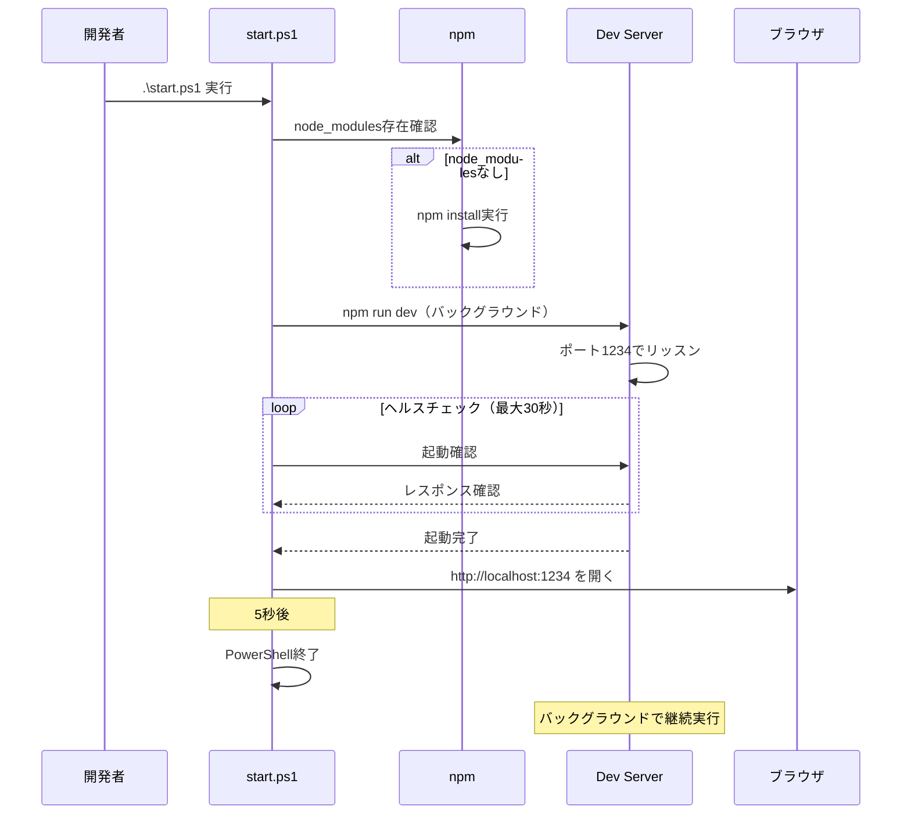
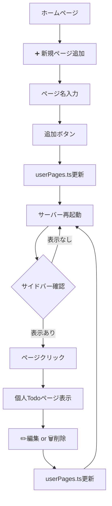
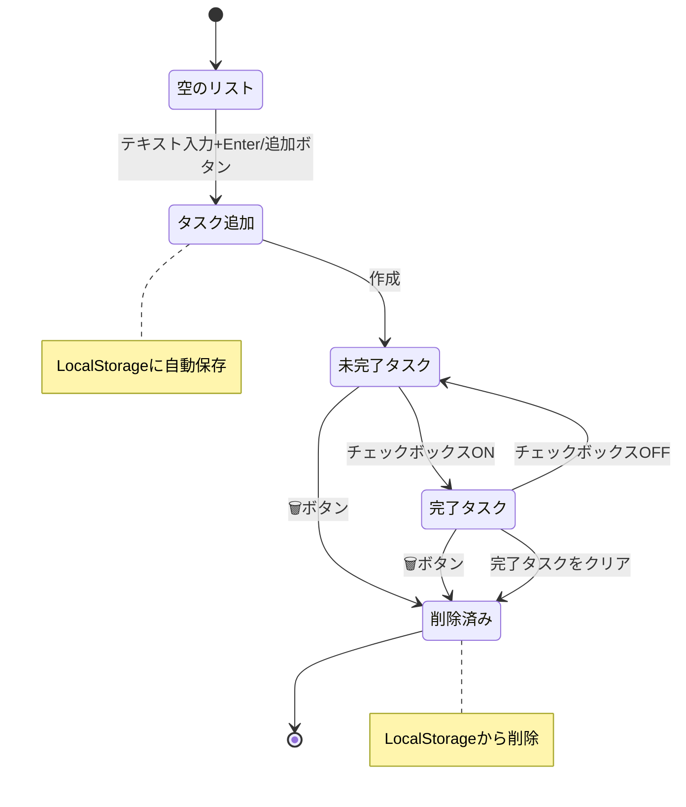
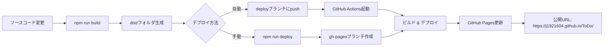
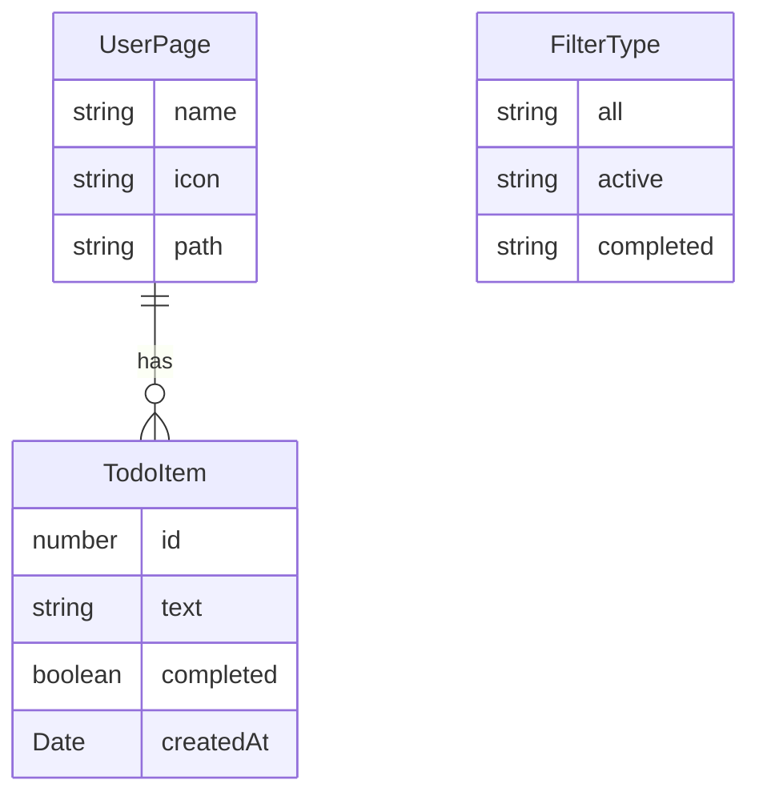

# 機能仕様書: 個人用Todoアプリケーション

**機能ブランチ**: `001-ToDo`  
**作成日**: 2025-11-20
**ステータス**: 下書き  
**入力**: テンプレートベースの個人用Todoページ作成とGitHub Pagesデプロイ可能なアプリケーション

## ユーザーシナリオとテスト *(必須)*

### ユーザーストーリー1 - ワンコマンド開発環境起動 (優先度: P1)

開発者は、PowerShellスクリプトを実行するだけで、開発環境が自動的にセットアップされ、ブラウザでアプリケーションが開かれる。

**優先度の理由**: 開発体験の向上は生産性に直結する。初心者でも迷わず開発を開始できることが最も重要。

**独立テスト**: `.\start.ps1`を実行し、以下が自動的に行われることを確認:

- npm依存関係のインストール（未インストール時）
- 開発サーバーがポート1234で起動
- ブラウザで http://localhost:1234 が自動的に開く
- PowerShellウィンドウが5秒後に自動終了

**受入シナリオ**:

1. **前提条件** 新規環境（node_modulesなし）、**操作** `.\start.ps1`実行、**期待結果** npm installが実行され、サーバーが起動し、ブラウザが開く
2. **前提条件** 既存環境（node_modulesあり）、**操作** `.\start.ps1`実行、**期待結果** インストールをスキップし、即座にサーバーが起動
3. **前提条件** サーバー起動後、**操作** 5秒待機、**期待結果** PowerShellウィンドウが自動終了するが、サーバーはバックグラウンドで継続実行

---

### ユーザーストーリー2 - 個人用Todoページの作成と管理 (優先度: P1)

ユーザーは、UIから個人用のTodoページを追加し、ページ名の編集や削除ができる。各ページは独立したタスクデータを持つ。

**優先度の理由**: アプリケーションの中核機能。複数ユーザーや複数プロジェクトの管理が可能になる。

**独立テスト**:

1. サイドバーの「➕ 新規ページ追加」ボタンをクリック
2. ページ名（例: 「田中」）を入力して追加
3. サーバーを再起動
4. サイドバーに新しいページが表示され、クリックで開けることを確認
5. ページ名を編集し、サーバー再起動後に反映を確認
6. ページを削除し、サーバー再起動後に消えていることと、そのページのタスクデータも削除されていることを確認

**受入シナリオ**:

1. **前提条件** ホームページ表示、**操作** 「➕ 新規ページ追加」をクリックし「田中」と入力、**期待結果** サイドバーに「📝 田中」が追加される
2. **前提条件** ページ「田中」が存在、**操作** ✏️ボタンをクリックし「Tanaka」に変更、**期待結果** サーバー再起動後、「📝 Tanaka」と表示される
3. **前提条件** ページ「Tanaka」にタスクが3件存在、**操作** 🗑️ボタンをクリック、**期待結果** ページとタスクデータが完全に削除され、サーバー再起動後も復元されない
4. **前提条件** ページが0件、**操作** 新規ページ追加、**期待結果** デフォルトアイコン📝が自動設定される

---

### ユーザーストーリー3 - タスクのCRUD操作とフィルタリング (優先度: P1)

ユーザーは、各個人用ページでタスクの追加、完了切り替え、個別削除、一括削除、フィルタリングができる。すべての操作はLocalStorageに自動保存される。

**優先度の理由**: Todoアプリの基本機能。ユーザーの日常的なタスク管理を支える。

**独立テスト**:

1. タスクを入力してEnterキーまたは「➕ 追加」ボタンでタスクが追加されることを確認
2. チェックボックスをクリックして完了/未完了が切り替わることを確認
3. 🗑️ボタンでタスクが削除されることを確認
4. フィルター（すべて/進行中/完了済み）で表示が変わることを確認
5. 「完了タスクをクリア」ボタンで完了済みタスクが一括削除されることを確認
6. ページをリロードしても、タスクデータが保持されることを確認

**受入シナリオ**:

1. **前提条件** 空のタスクリスト、**操作** 「買い物」と入力してEnter、**期待結果** タスクがリストに追加され、LocalStorageに保存される
2. **前提条件** タスク「買い物」が未完了、**操作** チェックボックスをクリック、**期待結果** タスクに取り消し線が表示され、完了状態に変更される
3. **前提条件** タスク3件（2件完了、1件未完了）、**操作** 「完了済み」フィルターをクリック、**期待結果** 完了した2件のみ表示される
4. **前提条件** 完了タスク2件、**操作** 「完了タスクをクリア (2)」ボタンをクリック、**期待結果** 完了タスクが全て削除され、ボタンが非表示になる
5. **前提条件** タスク5件、**操作** ページをリロード、**期待結果** 5件のタスクがすべて表示され、完了状態も維持される
6. **前提条件** タスク「買い物」が表示中、**操作** 🗑️ボタンをクリック、**期待結果** タスクが即座にリストから削除され、LocalStorageも更新される

---

### ユーザーストーリー4 - GitHub Pagesへのデプロイ (優先度: P2)

開発者は、ビルドコマンドを実行し、生成された静的ファイルをGitHub Pagesにデプロイして公開できる。

**優先度の理由**: 完成したアプリを公開する重要な機能だが、開発中は不要。

**独立テスト**:

1. `npm run build`を実行し、distフォルダが生成されることを確認
2. `npm run preview`でビルド結果をローカルプレビュー
3. GitHub Actionsワークフローが正常に動作し、GitHub Pagesにデプロイされることを確認
4. デプロイ後のURLでアプリケーションが正常に動作することを確認

**受入シナリオ**:

1. **前提条件** ソースコードの変更完了、**操作** `npm run build`実行、**期待結果** distフォルダに最適化された静的ファイルが生成される
2. **前提条件** distフォルダ生成済み、**操作** `npm run preview`実行、**期待結果** ローカルでビルド結果を確認できる
3. **前提条件** deployブランチにプッシュ、**操作** GitHub Actionsワークフロー起動、**期待結果** 自動的にビルドとデプロイが実行される
4. **前提条件** デプロイ完了、**操作** GitHub PagesのURLにアクセス、**期待結果** アプリケーションが正常に表示され、全機能が動作する

---

### エッジケース

- **空文字入力**: 空のタスクや空のページ名を追加しようとした場合、何も追加されない
- **重複ページ名**: 同じ名前のページを複数作成した場合、それぞれ独立したページとして動作する
- **LocalStorage容量**: 5MBを超えるデータを保存しようとした場合、エラーが発生する可能性がある（ブラウザ依存）
- **サーバー未起動時のアクセス**: 開発サーバーが起動していない状態でlocalhost:1234にアクセスした場合、接続エラーが表示される
- **ページ削除の確認**: ページ削除時に確認ダイアログなしで即座に削除される
- **長いタスク名**: 非常に長いタスク名を入力した場合、UIが適切に表示されること
- **特殊文字**: タスク名やページ名に特殊文字（絵文字、HTML特殊文字等）を含めても正常に動作すること

## 要件 *(必須)*

### 機能要件

**開発環境**

- **FR-001**: システムは、PowerShellスクリプト（start.ps1）によるワンコマンド起動をサポートしなければならない（MUST）
- **FR-002**: start.ps1は、node_modulesが存在しない場合、npm installを自動実行しなければならない（MUST）
- **FR-003**: start.ps1は、開発サーバーをバックグラウンドで起動し、ポート1234でリッスンしなければならない（MUST）
- **FR-004**: start.ps1は、サーバー起動確認後、ブラウザで http://localhost:1234 を自動的に開かなければならない（MUST）
- **FR-005**: start.ps1は、ブラウザオープン後5秒でPowerShellウィンドウを自動終了しなければならない（MUST）
- **FR-006**: 開発サーバーは、PowerShell終了後もバックグラウンドで継続実行しなければならない（MUST）

**ページ管理**

- **FR-007**: システムは、UIから個人用Todoページを追加できなければならない（MUST）
- **FR-008**: ページ追加時、ページ名を入力できなければならない（MUST）
- **FR-009**: ページ追加時、デフォルトアイコン📝が自動設定されなければならない（MUST）
- **FR-010**: システムは、追加されたページをサイドバーにリスト表示しなければならない（MUST）
- **FR-011**: ユーザーは、サイドバーの✏️ボタンでページ名を編集できなければならない（MUST）
- **FR-012**: ユーザーは、サイドバーの🗑️ボタンでページを削除できなければならない（MUST）
- **FR-013**: ページ削除時、そのページに関連するすべてのタスクデータも削除しなければならない（MUST）
- **FR-014**: ページの追加・編集・削除後、開発サーバーを再起動しなければ変更が反映されない（制約として受け入れ）

**タスク管理**

- **FR-015**: ユーザーは、テキスト入力とEnterキーでタスクを追加できなければならない（MUST）
- **FR-016**: ユーザーは、「➕ 追加」ボタンでタスクを追加できなければならない（MUST）
- **FR-017**: 空のタスクは追加できてはならない（MUST NOT）
- **FR-018**: 各タスクには、ID、テキスト、完了状態、作成日時が含まれなければならない（MUST）
- **FR-019**: ユーザーは、チェックボックスでタスクの完了/未完了を切り替えられなければならない（MUST）
- **FR-020**: 完了タスクはテキストに取り消し線が表示されなければならない（MUST）
- **FR-021**: ユーザーは、各タスクの🗑️ボタンで個別削除できなければならない（MUST）
- **FR-022**: ユーザーは、「完了タスクをクリア」ボタンで完了済みタスクを一括削除できなければならない（MUST）
- **FR-023**: 「完了タスクをクリア」ボタンは、完了タスクが存在する場合のみ表示されなければならない（MUST）
- **FR-024**: 完了タスクをクリアボタンには、削除される完了タスク数が表示されなければならない（MUST）

**フィルタリング**

- **FR-025**: ユーザーは、「すべて」フィルターで全タスクを表示できなければならない（MUST）
- **FR-026**: ユーザーは、「進行中」フィルターで未完了タスクのみを表示できなければならない（MUST）
- **FR-027**: ユーザーは、「完了済み」フィルターで完了タスクのみを表示できなければならない（MUST）
- **FR-028**: 各フィルターボタンには、該当するタスク数が表示されなければならない（MUST）
- **FR-029**: アクティブなフィルターは視覚的に識別可能でなければならない（MUST）

**データ永続化**

- **FR-030**: システムは、各ページのタスクデータをLocalStorageに自動保存しなければならない（MUST）
- **FR-031**: LocalStorageのキーはページごとに一意でなければならない（MUST）
- **FR-032**: ページをリロードしても、タスクデータが保持されなければならない（MUST）
- **FR-033**: タスクの追加・更新・削除時、LocalStorageが即座に更新されなければならない（MUST）
- **FR-034**: LocalStorageからのデータ読み込みに失敗した場合、エラーをコンソールに出力しなければならない（MUST）

**デプロイ**

- **FR-035**: システムは、`npm run build`でプロダクション用静的ファイルを生成しなければならない（MUST）
- **FR-036**: システムは、`npm run preview`でビルド結果をローカルプレビューできなければならない（MUST）
- **FR-037**: GitHub Actionsワークフローにより、deployブランチへのプッシュで自動デプロイされなければならない（MUST）
- **FR-038**: デプロイされたアプリケーションは、GitHub Pages上で正常に動作しなければならない（MUST）

### セキュリティ要件 *(機密データを扱う場合は必須)*

このアプリケーションは個人のローカル環境で動作し、機密データを扱わないため、セキュリティ要件は最小限です。

- **SR-001**: LocalStorageに保存されるデータは、ブラウザ内でのみアクセス可能でなければならない（MUST）
- **SR-002**: ユーザー入力（タスク名、ページ名）はHTMLエスケープ処理されなければならない（MUST）

### パフォーマンス要件 *(必須)*

- **PR-001**: アプリケーションの初期ロードは2秒以内に完了しなければならない（MUST）
- **PR-002**: タスクの追加、削除、完了切り替え操作は100ms以内にUIに反映されなければならない（MUST）
- **PR-003**: フィルター切り替えは即座に（50ms以内に）表示が更新されなければならない（MUST）
- **PR-004**: 開発サーバーの起動は30秒以内に完了しなければならない（MUST）
- **PR-005**: ビルド時間は1秒以内でなければならない（MUST）

### アクセシビリティ要件

- **AR-001**: すべてのインタラクティブ要素（ボタン、チェックボックス）にARIA属性を設定しなければならない（MUST）
- **AR-002**: キーボード操作のみで全機能にアクセス可能でなければならない（MUST）
- **AR-003**: フォーカス状態が視覚的に明確でなければならない（MUST）
- **AR-004**: スクリーンリーダーで読み上げ可能でなければならない（MUST）

### 主要エンティティ *(機能がデータを扱う場合に含める)*

**TodoItem**

- id: number - タスクの一意識別子（Date.now()で生成）
- text: string - タスクのテキスト内容
- completed: boolean - 完了状態（true=完了、false=未完了）
- createdAt: Date - タスクの作成日時

**UserPage**

- name: string - ページ名（例: "田中", "Tanaka"）
- icon: string - ページアイコン（デフォルト: "📝"）
- path: string - ページコンポーネントのパス（例: "./pages/TanakaPage"）

**FilterType**

- 'all' - すべてのタスクを表示
- 'active' - 未完了タスクのみ表示
- 'completed' - 完了タスクのみ表示

## 成功基準 *(必須)*

### 測定可能な成果

- **SC-001**: 開発者が `.\start.ps1` を実行してから、ブラウザでアプリケーションが開くまでの時間が30秒以内である
- **SC-002**: 新規ページの追加から、サイドバーに表示されるまでの操作ステップが3ステップ以内である（入力→追加→再起動）
- **SC-003**: タスクの追加操作が100ms以内に画面に反映される
- **SC-004**: 100件のタスクが登録されている状態でも、フィルター操作が50ms以内に完了する
- **SC-005**: ページリロード後、すべてのタスクデータ（100件）が正確に復元される
- **SC-006**: ビルドプロセスが1秒以内に完了する
- **SC-007**: GitHub Pagesデプロイが成功し、公開URLで全機能が動作する
- **SC-008**: 初心者が環境構築からタスク追加まで5分以内に完了できる（ドキュメント参照）

## 憲法準拠チェック

このセクションは、プロジェクト憲法への準拠を確認するために使用されます。

**テスト駆動開発**:

- [X] すべての受入シナリオにテストケースが定義されている
- [X] テストファーストアプローチが明示されている（106テスト、100%カバレッジ）

**セキュリティファースト**:

- [X] 機密データを扱う場合、セキュリティ要件が定義されている（HTMLエスケープ処理）
- [X] LocalStorageのアクセス制限が明示されている

**パフォーマンス基準**:

- [X] パフォーマンス要件が定量的な閾値で定義されている（PR-001〜PR-005）
- [X] 成功基準にパフォーマンスメトリックが含まれている（SC-001、SC-003、SC-004、SC-006）

**ユーザー体験**:

- [X] アクセシビリティ要件が定義されている（AR-001〜AR-004）
- [X] レスポンシブデザインの要件が含まれている（モバイル＆デスクトップ対応）

## 前提条件と制約

### 前提条件

- Node.js 16以上がインストールされていること
- npm 8以上がインストールされていること
- Windows環境（PowerShellスクリプト使用）
- Git がインストールされていること

### 制約

- ページの追加・編集・削除後は開発サーバーの再起動が必須
- LocalStorageの容量制限（ブラウザ依存、通常5MB）
- シングルユーザー環境（複数ユーザー間のデータ共有なし）
- オフライン動作のみ（サーバー側データベース不使用）

## 想定される技術スタック（参考）

※これは実装の参考情報であり、仕様ではありません。

- React 18.2.0
- TypeScript 4.9.3
- Vite 4.2.0（ビルドツール）
- React Router 6.10.0（ルーティング）
- Vitest 0.34.0（テストフレームワーク）
- Testing Library 14.1.2（テストライブラリ）
- LocalStorage API（データ永続化）
- GitHub Pages（デプロイ）
