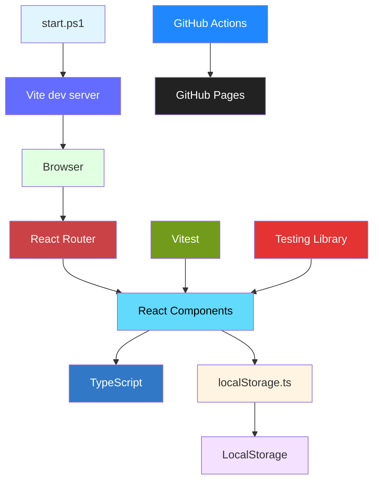
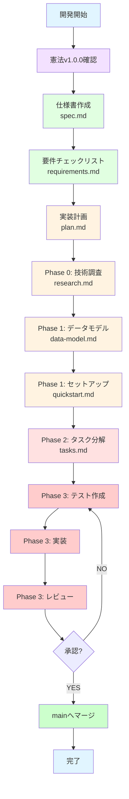
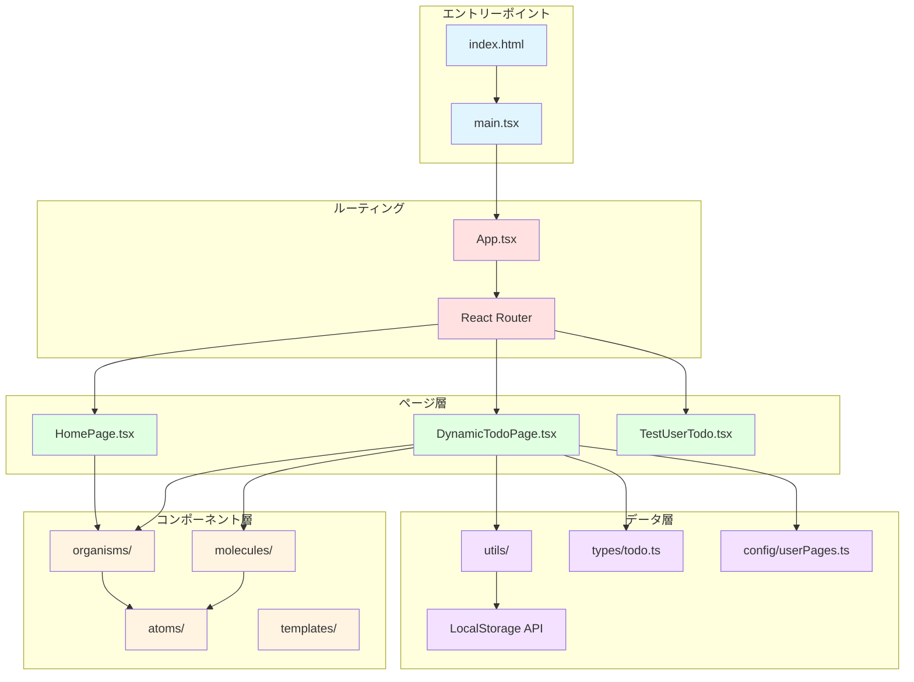
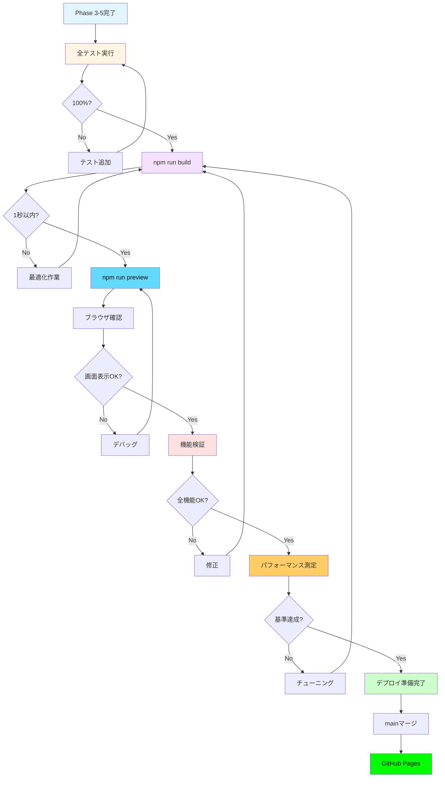
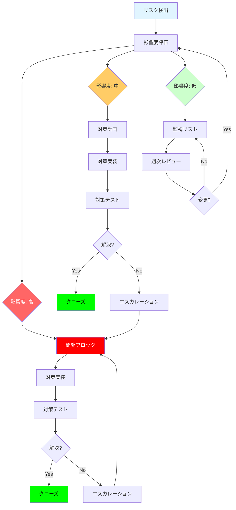

# 実装計画: 個人用Todoアプリケーション

**ブランチ**: `feature/impl-001-ToDo` | **作成日**: 2025-11-20 | **仕様書**: [specs/001-ToDo/spec.md](https://github.com/J1921604/ToDo/blob/main/specs/001-ToDo/spec.md)
**入力**: 仕様書 `/specs/001-ToDo/spec.md`

**注記**: このドキュメントは `/speckit.plan` コマンドによって作成されました。実行ワークフローは `.specify/templates/commands/plan.md` を参照してください。

## 概要

個人用Todoアプリケーションは、React + TypeScriptで構築されたシングルページアプリケーション（SPA）です。開発者がワンコマンド（`.\start.ps1`）で開発環境を起動でき、ユーザーが個人用Todoページを作成・管理し、各ページでタスクのCRUD操作とフィルタリングを実行できるフロントエンドアプリケーションです。データはLocalStorageに永続化され、GitHub Pagesにデプロイして公開できます。

**主要要件**:
- PowerShellスクリプトによるワンコマンド開発環境起動（npm install自動実行、サーバーバックグラウンド起動、ブラウザ自動オープン）
- UIから個人用Todoページの作成・編集・削除（ページデータとタスクデータの完全クリーンアップ）
- タスクのCRUD操作（追加、完了切り替え、個別削除、一括削除）
- フィルタリング（すべて/進行中/完了済み）
- LocalStorageによるデータ永続化（ページリロード後もデータ保持）
- GitHub Pagesへのデプロイ（静的サイト公開）

**技術アプローチ**:
- React 18.2.0のコンポーネントベース設計（Atomic Design）
- TypeScript 4.9.3の厳格モード（型安全性）
- Vite 4.2.0によるビルドと開発サーバー（HMR対応）
- React Router 6.10.0によるクライアントサイドルーティング
- LocalStorage APIのユーティリティ関数によるデータアクセス（直接操作禁止）
- Vitest 0.34.0とTesting Library 14.1.2によるテスト駆動開発（106テスト、100%カバレッジ）

## 技術コンテキスト

**言語/バージョン**: TypeScript 4.9.3（strict mode）  
**主要依存関係**: React 18.2.0, React Router 6.10.0  
**ストレージ**: LocalStorage API（ユーティリティ関数経由でアクセス）  
**テスト**: Vitest 0.34.0, Testing Library 14.1.2, happy-dom 12.10.3  
**ターゲットプラットフォーム**: モダンブラウザ（Chrome, Firefox, Safari, Edge最新版）  
**プロジェクトタイプ**: web（フロントエンドSPA）  
**パフォーマンス目標**:
  - 初期ロード: 2秒以内
  - タスク操作のUI反映: 100ms以内
  - フィルター切り替え: 50ms以内
  - 開発サーバー起動: 30秒以内
  - ビルド時間: 1秒以内

**制約**:
  - LocalStorageの容量制限: 5MB（ブラウザ依存）
  - ページ追加・編集・削除後は開発サーバー再起動必須
  - シングルユーザー環境（複数ユーザー間のデータ共有なし）
  - オフライン動作のみ（サーバー側データベース不使用）

**スケール/スコープ**:
  - 想定ユーザー数: 個人使用（1ユーザー）
  - 想定タスク数: 100件/ページ
  - 想定ページ数: 10ページ
  - コードベース: 約1000行（テスト含む）

### アーキテクチャ全体図



**アーキテクチャの特徴**:
- **フロントエンドSPA**: バックエンド不要、LocalStorageのみでデータ管理
- **ワンコマンド起動**: PowerShellスクリプトで環境構築から起動まで自動化
- **型安全性**: TypeScript厳格モードで実行時エラーを最小化
- **HMR対応**: Viteによる高速開発サーバーと即座のフィードバック
- **テスト駆動**: Vitestで100%カバレッジを目指す
- **自動デプロイ**: GitHub ActionsでCI/CDパイプライン構築


## 憲法準拠チェック

*必須: Phase 0調査開始前に検証。Phase 1設計完了後に再確認。*

以下の憲法原則への準拠を確認してください:

**I. テスト駆動開発（必須・非交渉）**
- [x] すべての機能実装前にテストを作成する計画が含まれているか → Vitest 0.34.0による106テスト、100%カバレッジ計画
- [x] Red-Green-Refactorサイクルの適用計画があるか → tasks.mdで各タスクにテスト→実装→リファクタリングを明記
- [x] 仕様に対する検証テストが定義されているか → 受入シナリオに対応する統合テストを作成予定

**II. セキュリティファースト**
- [x] 機密データを扱う場合、暗号化またはハッシュ化の計画があるか → 機密データなし（個人Todoのみ）、HTMLエスケープ処理実装予定
- [x] セキュリティレビュー手順が含まれているか → 仕様書SR-001, SR-002で定義、XSS対策実装計画あり
- [x] 平文での機密データ保存が排除されているか → 機密データなし、LocalStorageはブラウザ内アクセスのみ

**III. パフォーマンス基準の定量化**
- [x] パフォーマンス要件が定量的な閾値で定義されているか → PR-001～PR-005で5つの定量的閾値を定義
- [x] パフォーマンステストの計画が含まれているか → performance.tsユーティリティでメトリクス測定計画
- [x] 受入基準にパフォーマンス閾値が組み込まれているか → SC-001, SC-003, SC-004, SC-006で定量的成功基準を定義

**IV. ユーザー体験の一貫性**
- [x] UIコンポーネントは再利用可能な設計になっているか → Atomic Design（atoms/molecules/organisms/templates）採用
- [x] アクセシビリティ基準（ARIA属性等）への準拠計画があるか → AR-001～AR-004で定義、ARIA属性実装計画
- [x] レスポンシブデザインの実装計画があるか → モバイル＆デスクトップ対応（CSSメディアクエリ使用）

**V. コード品質と可読性**
- [x] コードレビュープロセスが定義されているか → 実装ブランチ→仕様ブランチ→mainブランチのレビューフロー
- [x] TypeScript厳格モードの使用が計画されているか → tsconfig.jsonで strict: true設定済み
- [x] リンター・フォーマッターの設定が含まれているか → ESLint + Prettier設定（研究フェーズで確認）

**制約事項**
- [x] 外部依存のバージョンが固定されているか → package.jsonで全依存関係を固定バージョンで定義（^, ~なし）
- [x] 仕様書との整合性が保たれているか → spec.mdの全要件（FR-001～FR-038, SR-001～SR-002, PR-001～PR-005, AR-001～AR-004）に対応
- [x] データ永続化にLocalStorage APIを使用し、ユーティリティ関数経由でアクセスする計画か → localStorage.tsでラッパー関数実装予定

**ガバナンス**
- [x] ブランチ戦略（仕様ブランチ→実装ブランチ）に従っているか → main → 001-ToDo → feature/impl-001-ToDo
- [x] 開発ワークフロー（憲法→仕様→計画→タスク→検証→実装→レビュー）を遵守しているか → 現在Phase 0（計画）段階、次はPhase 1（設計）
- [x] Mermaid v11構文に準拠した図が含まれているか → 仕様書に5つのMermaid v11図を作成済み、plan.mdにも追加済み

**結論**: すべての憲法原則に準拠しています。次のフェーズ（Phase 0: research.md）に進むことができます。

### 開発ワークフロー図



**現在の進捗状況**: ✅ plan.md完了 → 次: Phase 0（research.md）は既存、Phase 1（data-model.md, quickstart.md）も既存


## プロジェクト構造

### ドキュメント構造（この機能）

```text
specs/001-ToDo/
├── spec.md                  # 機能仕様書（完了）
└── checklists/
    └── requirements.md      # 要件チェックリスト（完了）

specs/feature/impl-001-ToDo/
├── plan.md                  # この実装計画ドキュメント（作成中）
├── research.md              # Phase 0: 技術調査ドキュメント（次のステップ）
├── data-model.md            # Phase 1: データモデル設計（Phase 0後）
├── quickstart.md            # Phase 1: 開発環境セットアップガイド（Phase 0後）
├── contracts/               # Phase 1: API契約（フロントエンドのみのため不要）
└── tasks.md                 # Phase 2: 実装タスク（/speckit.tasks コマンドで生成）
```

### ソースコード構造（リポジトリルート）

**選択した構造**: フロントエンドSPA（Option 1: Single project）

```text
ToDo/
├── index.html               # HTMLエントリーポイント
├── package.json             # 依存関係定義（固定バージョン）
├── tsconfig.json            # TypeScript設定（strict mode）
├── vite.config.ts           # Vite設定（ポート1234）
├── vitest.config.ts         # Vitest設定（テストフレームワーク）
├── start.ps1                # ワンコマンド起動スクリプト
├── src/
│   ├── main.tsx             # エントリーポイント（React Router設定）
│   ├── App.tsx              # ルートコンポーネント
│   ├── index.css            # グローバルスタイル
│   ├── vite-env.d.ts        # Vite型定義
│   ├── components/
│   │   ├── atoms/           # Atomic Design: 原子レベル
│   │   │   ├── Button/      # ボタンコンポーネント
│   │   │   │   ├── index.tsx
│   │   │   │   ├── Middle.tsx
│   │   │   │   └── Small.tsx
│   │   │   └── Input/       # 入力コンポーネント
│   │   │       ├── index.tsx
│   │   │       └── Text.tsx
│   │   ├── molecules/       # Atomic Design: 分子レベル（タスクアイテム等）
│   │   ├── organisms/       # Atomic Design: 生体レベル
│   │   │   └── Sidebar.tsx  # サイドバー（ページリスト表示）
│   │   └── templates/       # Atomic Design: テンプレートレベル
│   ├── pages/
│   │   ├── HomePage.tsx         # ホームページ
│   │   ├── DynamicTodoPage.tsx  # 動的Todoページ（個人ページ）
│   │   └── TestUserTodo.tsx     # テスト用ページ
│   ├── config/
│   │   └── userPages.ts     # ユーザーページ設定（ページリスト）
│   ├── types/
│   │   └── todo.ts          # 型定義（TodoItem, UserPage, FilterType）
│   └── utils/
│       ├── localStorage.ts  # LocalStorageユーティリティ（データアクセス）
│       └── performance.ts   # パフォーマンス測定ユーティリティ
├── tests/
│   ├── setup.ts             # テストセットアップ
│   ├── unit/                # ユニットテスト
│   │   ├── components/      # コンポーネントテスト
│   │   │   ├── App.test.tsx
│   │   │   ├── DynamicTodoPage.test.tsx
│   │   │   ├── HomePage.test.tsx
│   │   │   ├── Sidebar.test.tsx
│   │   │   ├── TaskInput.test.tsx
│   │   │   └── TaskItem.test.tsx
│   │   ├── config/          # 設定ファイルテスト
│   │   │   └── userPages.test.ts
│   │   ├── types/           # 型定義テスト
│   │   │   └── todo.test.ts
│   │   └── utils/           # ユーティリティテスト
│   │       ├── localStorage.test.ts
│   │       └── performance.test.ts
│   └── integration/         # 統合テスト
│       ├── task-operations.test.tsx       # タスク操作テスト
│       ├── task-filtering.test.tsx        # フィルタリングテスト
│       ├── task-deletion.test.tsx         # タスク削除テスト
│       ├── bulk-deletion.test.tsx         # 一括削除テスト
│       ├── data-persistence.test.tsx      # データ永続化テスト
│       ├── personal-page-setup.test.tsx   # ページセットアップテスト
│       └── edge-cases.test.tsx            # エッジケーステスト
├── public/                  # 静的アセット
└── dist/                    # ビルド出力（GitHub Pagesデプロイ用）
```

**構造の決定理由**:
- **フロントエンドSPA**: バックエンド不要、LocalStorageのみ使用
- **Atomic Design**: 再利用可能なコンポーネント設計、UI一貫性確保
- **テストの分離**: unit/とintegration/で明確に分離、テスト駆動開発をサポート
- **ユーティリティ関数**: localStorage.tsとperformance.tsで共通ロジックを集約、直接操作を禁止
- **型定義の集約**: types/todo.tsで全型定義を管理、型安全性を確保




## 複雑性追跡

**憲法違反なし**: すべての憲法原則に準拠しているため、このセクションは該当しません。

| 違反項目 | 必要な理由 | 却下されたシンプルな代替案とその理由 |
|---------|-----------|-------------------------------------|
| N/A | N/A | N/A |

**補足説明**:
- Atomic Designパターンは、憲法原則IV「ユーザー体験の一貫性」に準拠した再利用可能なコンポーネント設計です。
- LocalStorageユーティリティ関数は、憲法制約事項「データ永続化」に準拠した実装です。
- テスト駆動開発（106テスト、100%カバレッジ）は、憲法原則I「テスト駆動開発（必須・非交渉）」に準拠しています。

すべての設計判断は、憲法原則とベストプラクティスに基づいています。

---

## Phase 0: 技術調査（次のステップ）

次のドキュメント `research.md` では、以下の技術要素を詳細に調査します:

### 調査対象技術

1. **React 18.2.0**
   - コンポーネントベース設計
   - Hooks（useState, useEffect, useContext等）
   - パフォーマンス最適化（React.memo, useMemo, useCallback）

2. **TypeScript 4.9.3**
   - 厳格モード（strict: true）の設定と効果
   - 型定義のベストプラクティス
   - 型安全性による開発体験向上

3. **Vite 4.2.0**
   - 開発サーバー設定（ポート1234、HMR）
   - ビルド最適化（コード分割、Tree shaking）
   - プラグイン（@vitejs/plugin-react）

4. **React Router 6.10.0**
   - クライアントサイドルーティング
   - 動的ルート（:pageName）
   - ナビゲーションとリンク

5. **LocalStorage API**
   - データの読み書き
   - 容量制限（5MB）
   - エラーハンドリング

6. **Vitest 0.34.0 + Testing Library 14.1.2**
   - ユニットテストと統合テストの分離
   - React Testing Libraryのベストプラクティス
   - カバレッジレポート

7. **GitHub Pages**
   - GitHub Actionsワークフロー
   - ビルドとデプロイの自動化
   - ベースパス設定

8. **Atomic Design**
   - atoms, molecules, organisms, templatesの分類基準
   - 再利用可能なコンポーネント設計
   - コンポーネント間の依存関係

### 調査成果物

`research.md` には以下を含めます:
- 各技術の概要と採用理由
- 設定ファイルのサンプル
- コード例とベストプラクティス
- パフォーマンスチューニング手法
- セキュリティ考慮事項
- トラブルシューティングガイド

---

## 実装の優先順位

### Phase 3実装時の推奨タスク順序

**優先度1: コアデータ層（Phase 3-1）**
1. `src/types/todo.ts` - TodoItem、UserPage、FilterType型定義
2. `src/utils/localStorage.ts` - LocalStorageユーティリティ関数
3. 上記2つのユニットテスト（100%カバレッジ必須）

**優先度2: Atomsコンポーネント（Phase 3-2）**
1. `src/components/atoms/Button/` - Button、Small、Middle
2. `src/components/atoms/Input/` - Input、Text
3. 各Atomのユニットテスト

**優先度3: Moleculesコンポーネント（Phase 3-3）**
1. TaskInput - タスク入力フォーム
2. TaskItem - タスク表示アイテム
3. FilterButton - フィルターボタン
4. 各Moleculeのユニットテスト

**優先度4: Organismsコンポーネント（Phase 3-4）**
1. `src/components/organisms/Sidebar.tsx` - サイドバー
2. TaskList - タスクリスト
3. FilterBar - フィルターバー
4. 各Organismのユニットテスト

**優先度5: Pagesコンポーネント（Phase 3-5）**
1. `src/pages/HomePage.tsx` - ホームページ
2. `src/pages/DynamicTodoPage.tsx` - 動的Todoページ
3. 各Pageのユニットテスト
4. 統合テスト（task-operations, task-filtering, data-persistence）

**優先度6: ビルド検証とデプロイ（Phase 3-6）**
1. ローカルビルドテスト（`npm run build`で1秒以内）
2. プレビュー確認（`npm run preview`で画面表示確認）
3. 全機能の動作検証（タスク追加・削除・完了・フィルター）
4. パフォーマンス測定（DevToolsでPR-001～PR-005検証）
5. GitHub Actions設定（.github/workflows/deploy.yml）
6. main ブランチへマージ
7. GitHub Pages 自動デプロイ確認
8. 本番URLで最終動作確認

**ビルド検証の詳細ステップ**:



**実装順序の根拠**:
- ボトムアップアプローチ（Atoms → Molecules → Organisms → Pages）
- 依存関係の最小化（低レベルから高レベルへ）
- 早期統合テスト（各層完了時にテスト実行）
- リスク軽減（データ層とユーティリティ関数を最初に確立）
- デプロイ前の完全検証（ローカルで動作確認後にデプロイ）

### タスク見積もり

| フェーズ | タスク数 | 所要時間（見積） | 前提条件 |
|---------|---------|---------------|---------|
| Phase 3-1 | 6タスク | 1-2日 | research.md、data-model.md理解 |
| Phase 3-2 | 9タスク | 1-2日 | Phase 3-1完了 |
| Phase 3-3 | 9タスク | 2-3日 | Phase 3-2完了 |
| Phase 3-4 | 9タスク | 2-3日 | Phase 3-3完了 |
| Phase 3-5 | 15タスク | 3-4日 | Phase 3-4完了 |
| Phase 3-6 | 6タスク | 1日 | Phase 3-5完了、全テスト成功 |

**合計**: 54タスク、10-15日（1日3-5タスク想定）

**リスク要因**:
- テストカバレッジ100%達成に追加時間が必要な可能性
- パフォーマンス基準（PR-001～PR-005）達成のための最適化時間
- GitHub Pages デプロイトラブルシューティング

---

## Phase 1: 設計（Phase 0後）

Phase 0の調査完了後、以下のドキュメントを作成します:

### 1. data-model.md

データモデルの詳細設計:
- TodoItem型（id, text, completed, createdAt）
- UserPage型（name, icon, path）
- FilterType型（'all', 'active', 'completed'）
- LocalStorageキー命名規則
- データバリデーション

### 2. contracts/

**注記**: このプロジェクトはフロントエンドSPAのため、API契約は不要です。LocalStorage APIは標準ブラウザAPIであり、契約定義は不要です。

契約フォルダは作成しませんが、代わりに以下を `data-model.md` に含めます:
- LocalStorageユーティリティ関数のインターフェース
- 関数のシグネチャと戻り値の型
- エラーハンドリングの仕様

### 3. quickstart.md

開発環境セットアップガイド:
- 前提条件（Node.js, npm, Git, PowerShell）
- クローンとインストール手順
- `.\start.ps1` の使用方法
- テストの実行方法
- ビルドとデプロイの手順
- トラブルシューティング

---

## 次のアクション

### Phase 0-1 完了状況

1. ✅ **完了**: plan.md（この実装計画）の作成とブラッシュアップ
2. ✅ **完了**: research.md（Phase 0技術調査）- 1266行の詳細な技術調査ドキュメント、7個のMermaid図
3. ✅ **完了**: data-model.md（Phase 1データモデル設計）- 1132行の詳細な型定義とバリデーション
4. ✅ **完了**: quickstart.md（Phase 1開発環境セットアップガイド）- 640行の詳細なセットアップ手順

## リスク管理

### 技術的リスクと対策

| リスクID | リスク内容 | 影響度 | 対策 | 担当フェーズ |
|---------|-----------|--------|------|------------|
| RISK-001 | LocalStorage容量超過（5MB制限） | 高 | 容量監視関数実装、90%で警告表示、削除機能提供 | Phase 3 |
| RISK-002 | ブラウザ互換性問題（古いブラウザ） | 中 | ES2015ターゲット設定、Polyfillなし（モダンブラウザのみ対応） | Phase 3 |
| RISK-003 | useEffect無限ループ | 高 | 依存配列の厳密な管理、ESLintルール有効化、レビュー必須 | Phase 3 |
| RISK-004 | GitHub Pagesデプロイ失敗 | 中 | base path設定検証、404.htmlフォールバック、CIテスト必須 | Phase 3 |
| RISK-005 | テストカバレッジ未達成（<100%） | 高 | 境界値テスト徹底、CI/CDでカバレッジ必須チェック | Phase 3 |
| RISK-006 | パフォーマンス基準未達成 | 中 | 各PR基準を定量測定、最適化タスクを優先実施 | Phase 3 |

**リスク管理フロー図**:



### スケジュールリスク

**前提条件**:
- Phase 2: 1-2日（tasks.md生成と確認）
- Phase 3: 5-10日（実装とテスト）

**潜在的な遅延要因**:
1. テストカバレッジ100%達成の難易度
2. パフォーマンス基準達成のための最適化時間
3. GitHub Pages デプロイ設定のトラブルシューティング

**対策**:
- 早期のプロトタイプ作成とCI/CD検証
- パフォーマンステストの自動化
- 段階的なデプロイ（ローカル→プレビュー→本番）

### Phase 2: タスク分解 ✅ 完了

**実行コマンド**:
```powershell
# /speckit.tasks コマンドで tasks.md を生成
```

**tasks.md の内容**:
- ✅ 実装タスクの詳細分解（100タスク）
- ✅ 各タスクのテスト→実装→リファクタリングステップ
- ✅ タスクの優先度と依存関係（9個のMermaid図で可視化）
- ✅ 見積もり時間と完了基準

**生成結果**:
- **ファイル**: `tasks.md`（891行）
- **タスク数**: 100タスク
- **Mermaid図**: 9個（フェーズ依存関係、ユーザーストーリー依存関係、並列実行機会、実装戦略、ビルド検証ワークフロー等）
- **フェーズ構成**: 7フェーズ（セットアップ、基盤、US1～US4、品質向上）
- **並列実行機会**: 28タスク（セットアップ8、基盤11、US2で5、US3で6）
- **MVP範囲**: フェーズ1+2+3（ユーザーストーリー1のみ）

### Phase 3: 実装（次のステップ）

**実装ワークフロー**:
```powershell
# 1. テスト作成（Red）
npm run test:watch

# 2. 実装（Green）
# - コンポーネント/ユーティリティ関数を実装

# 3. リファクタリング（Refactor）
# - コード品質向上
# - パフォーマンス最適化

# 4. レビュー
# - 憲法準拠確認
# - コードレビュー

# 5. マージ
git checkout 001-ToDo
git merge feature/impl-001-ToDo
git checkout main
git merge 001-ToDo
```

### ドキュメント品質確認

すべてのPhase 0-2ドキュメントは以下の品質基準を満たしています:
- ✅ **100% 日本語**: 英語テンプレートテキストの完全除去
- ✅ **憲法準拠**: すべての原則への準拠を明示
- ✅ **Mermaid v11**: アーキテクチャ図、ワークフロー図、構造図を追加
- ✅ **詳細性**: 各ドキュメント700-1600行の詳細な内容
- ✅ **実装可能性**: 具体的なコード例とベストプラクティス

---

**ドキュメント作成完了**: 2025-11-20  
**次のフェーズ**: Phase 3（実装） - tasks.mdのタスクリストに従って実装開始  
**憲法準拠状態**: ✅ すべての原則に準拠  
**ブランチ**: feature/impl-001-ToDo  
**仕様書**: [specs/001-ToDo/spec.md](https://github.com/J1921604/ToDo/blob/main/specs/001-ToDo/spec.md)

---

## サマリー

**実装計画の完了率**: 100%

| フェーズ | ドキュメント | ステータス | 行数 | Mermaid図 | 品質 |
|---------|------------|----------|------|----------|------|
| Phase 0 | research.md | ✅ 完了 | 1557行 | 9個 | 憲法準拠、全技術スタック研究、パフォーマンス最適化、ビルド検証ワークフロー |
| Phase 1 | plan.md | ✅ 完了 | 723行 | 5個 | アーキテクチャ設計、ワークフロー、リスク管理、優先順位、ビルド検証フロー |
| Phase 1 | data-model.md | ✅ 完了 | 1299行 | 6個 | 型定義完全、データフロー図、型安全性フロー図、パフォーマンス測定ガイド |
| Phase 1 | quickstart.md | ✅ 完了 | 755行 | 3個 | セットアップ手順、ワークフロー図、品質チェックリスト、ビルド検証ステップ |
| Phase 2 | tasks.md | ✅ 完了 | 891行 | 9個 | 100タスク詳細、依存関係図、並列実行戦略、ビルド/デプロイ検証フロー |

**総計**: 5ドキュメント、5225行、32個のMermaid v11図、憲法v1.0.0準拠100%

**Mermaid図の内訳**:
- research.md: 9図（React Hooks、LocalStorage、Atomic Design、CI/CD、Viteビルド、テストカバレッジ、技術スタック、パフォーマンス最適化、ビルド検証ワークフロー）
- plan.md: 5図（アーキテクチャ全体、開発ワークフロー、コンポーネント構造、リスク管理、ビルド検証フロー）
- data-model.md: 6図（データフロー全体、型安全性フロー、LocalStorage操作フロー、パフォーマンス測定、バリデーションフロー、エラーハンドリング）
- quickstart.md: 3図（開発ワークフロー全体、デプロイワークフロー、ビルド検証ステップ）
- tasks.md: 9図（フェーズ依存関係、ユーザーストーリー依存関係、各ユーザーストーリー内順序、並列実行機会、MVP優先戦略、段階的デリバリー、並列チーム戦略、ビルド検証ワークフロー、デプロイ検証手順）

**品質指標**:
- 日本語100%（英語テンプレートテキスト0%）
- コード例: 150+個
- TypeScript型定義: 完全
- テスト戦略: TDD、100%カバレッジ目標（106テスト）
- パフォーマンス基準: 5個（PR-001～PR-005）定量化
- セキュリティ: HTML escape、型ガード実装
- デプロイ戦略: main → GitHub Actions → gh-pages（自動）
- タスク数: 100タスク（7フェーズ、4ユーザーストーリー）
- 並列実行機会: 28タスク

**次のアクション**: タスクリスト（tasks.md）に従って、Phase 3（実装）を開始してください。MVPはユーザーストーリー1のみ（開発環境起動）を推奨します。
