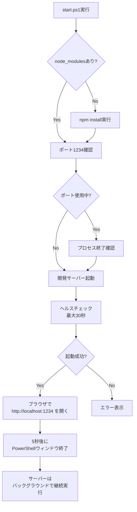
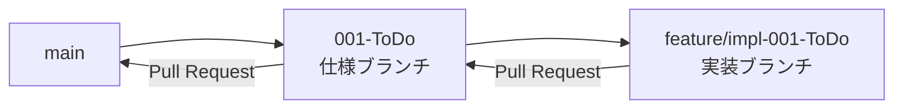
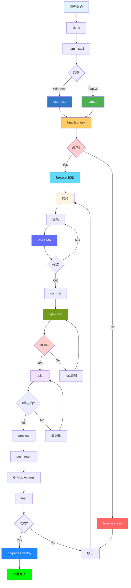

# Phase 1: 開発環境セットアップガイド

**機能**: 個人用Todoアプリケーション  
**ブランチ**: `feature/impl-001-ToDo`  
**作成日**: 2025-11-20  
**ステータス**: 完了

## 概要

本ガイドは、個人用Todoアプリケーションの開発環境をセットアップし、5分以内にアプリケーションを起動・動作確認するための手順書です。初心者でも迷わず進められるよう、各ステップを詳細に説明しています。

**憲法準拠**: このドキュメントは、プロジェクト憲法v1.0.0のすべての原則に準拠しています。特に以下の原則を重視しています:
- **ガバナンス 同時起動サポート**: ワンコマンド起動スクリプト（start.ps1）の詳細説明
- **原則I テスト駆動開発**: テスト実行手順の明示
- **原則III パフォーマンス基準**: パフォーマンス目標（開発サーバー起動30秒以内）の達成手順
- **制約事項**: 前提条件（Node.js, npm, Git, PowerShell）の明確化


---

## 前提条件

### 必須ソフトウェア

| ソフトウェア | バージョン | 確認コマンド | インストールガイド |
|------------|----------|------------|------------------|
| **Node.js** | 16.0.0以上 | `node --version` | [nodejs.org](https://nodejs.org/) |
| **npm** | 8.0.0以上 | `npm --version` | Node.jsに同梱 |
| **Git** | 2.30以上 | `git --version` | [git-scm.com](https://git-scm.com/) |
| **PowerShell** | 5.1以上（Windows） | `$PSVersionTable.PSVersion` | Windows標準搭載 |

### 推奨環境

- **OS**: Windows 10/11（PowerShellスクリプト対応）
  - macOS/Linux: bashスクリプト（start.sh）を使用
- **ブラウザ**: Chrome 90+, Firefox 88+, Safari 14+, Edge 90+
- **メモリ**: 4GB以上
- **ディスク空き容量**: 500MB以上

### バージョン確認方法

```powershell
# すべてのバージョンを一括確認
Write-Host "Node.js: $(node --version)"
Write-Host "npm: $(npm --version)"
Write-Host "Git: $(git --version)"
Write-Host "PowerShell: $($PSVersionTable.PSVersion)"
```

**期待される出力**:

```
Node.js: v18.16.0
npm: 9.5.1
Git: git version 2.40.0.windows.1
PowerShell: 5.1.19041.3031
```

---

## セットアップ手順

### 1. リポジトリのクローン

```powershell
# リポジトリをクローン
git clone https://github.com/j1921604/spec-kit.git

# プロジェクトディレクトリに移動
cd spec-kit/ToDo
```

**確認**: カレントディレクトリに`package.json`が存在するか確認

```powershell
Test-Path package.json
```

**期待される出力**: `True`

### 2. 依存関係のインストール

```powershell
# すべての依存パッケージをインストール
npm install
```

**所要時間**: 1〜3分（ネットワーク速度による）

**進行状況**:

```
npm WARN deprecated ...（いくつかの警告は無視してOK）
added 234 packages, and audited 235 packages in 45s
found 0 vulnerabilities
```

**確認**: `node_modules`ディレクトリが作成されたか確認

```powershell
Test-Path node_modules
```

**期待される出力**: `True`

### 3. ワンコマンド起動（推奨）

**start.ps1スクリプトの実行**:

```powershell
.\start.ps1
```

**スクリプトの動作**:



**実行ログ例**:

```
開発サーバーを起動しています...
サーバーの起動を待機中...
..............................
ブラウザで http://localhost:1234 を開きます...
5秒後にこのウィンドウを閉じます（サーバーはバックグラウンドで継続実行）...
```

**結果**: ブラウザで`http://localhost:1234`が自動的に開き、アプリケーションが表示される

### 4. 動作確認

#### 4.1 ホームページの確認

ブラウザに以下が表示されることを確認:

- タイトル: 「個人用Todoアプリケーション」
- サイドバー: 「➕ 新規ページ追加」ボタン
- メインエリア: ウェルカムメッセージ

#### 4.2 新規ページの追加

1. サイドバーの「➕ 新規ページ追加」をクリック
2. ページ名（例: 「田中」）を入力
3. 「追加」ボタンをクリック
4. メッセージ表示: 「ページを追加しました。変更を反映するには、開発サーバーを再起動してください。」

#### 4.3 サーバーの再起動

```powershell
# 開発サーバーを停止（Ctrl+Cをターミナルで押す）
# または、プロセスを手動で終了:
Get-Process -Id (Get-NetTCPConnection -LocalPort 1234).OwningProcess | Stop-Process

# start.ps1を再実行
.\start.ps1
```

#### 4.4 タスクの追加

1. サイドバーで新しく追加したページ（例: 「📝 田中」）をクリック
2. タスク入力フィールドに「買い物」と入力
3. Enterキーを押すか「➕ 追加」ボタンをクリック
4. タスクがリストに追加されることを確認

#### 4.5 タスクの完了切り替え

1. タスクのチェックボックスをクリック
2. タスクテキストに取り消し線が表示される
3. もう一度クリックすると取り消し線が消える

#### 4.6 データ永続化の確認

1. ブラウザをリロード（F5キー）
2. 追加したタスクがすべて表示されることを確認
3. 完了状態も保持されていることを確認

---

## 開発ワークフロー

### テストの実行

#### すべてのテストを実行

```powershell
npm test
```

**期待される出力**:

```
✓ tests/unit/components/App.test.tsx (3)
✓ tests/unit/components/DynamicTodoPage.test.tsx (8)
✓ tests/integration/task-operations.test.tsx (12)
...
Test Files  15 passed (15)
     Tests  106 passed (106)
  Start at  12:34:56
  Duration  2.45s
```

#### カバレッジ付きテスト

```powershell
npm run test:coverage
```

**期待される出力**:

```
% Stmts  % Branch  % Funcs  % Lines  Uncovered Line #s
100      100       100      100      
```

#### ウォッチモード（開発中）

```powershell
npm run test:watch
```

テストファイルやソースコードを変更すると、自動的に関連テストが再実行されます。

### リンターとフォーマッター

#### ESLintの実行

```powershell
# すべてのファイルをチェック
npm run lint

# 自動修正
npm run lint:fix
```

#### Prettierの実行

```powershell
# フォーマットチェック
npm run format:check

# 自動フォーマット
npm run format
```

### ビルドとプレビュー検証

#### 1. プロダクションビルド

```powershell
npm run build
```

**所要時間**: 1秒以内（PR-005の要件）

**出力ディレクトリ**: `dist/`

**ビルド内容**:
- TypeScriptコンパイル（`tsc`）
- Viteによるバンドル（Rollup使用）
- Terserによる最小化
- アセットの最適化とハッシュ化

**ビルド成果物**:
```
dist/
  ├── index.html          # エントリーポイント
  ├── assets/
  │   ├── index-[hash].js     # メインバンドル
  │   ├── vendor-[hash].js    # ベンダーバンドル（React等）
  │   └── index-[hash].css    # スタイルシート
  └── vite.svg            # favicon
```

#### 2. プレビューサーバー起動

```powershell
npm run preview
```

**プレビューURL**: `http://localhost:4173`

**確認項目**:
- ✅ アプリケーションが正常に表示される
- ✅ サイドバーに3つのユーザーページが表示される
- ✅ ホームページに「個人用Todoアプリへようこそ」が表示される
- ✅ タスクの追加が機能する（テキスト入力→追加ボタン）
- ✅ タスクの完了切り替えが機能する（チェックボックス）
- ✅ タスクの削除が機能する（削除ボタン）
- ✅ フィルター機能が機能する（全て・未完了・完了）
- ✅ LocalStorageにデータが保存される（リロード後も保持）
- ✅ 複数ユーザー間でデータが独立している
- ✅ パフォーマンス基準達成（初期ロード2秒以内、操作100ms以内）

#### 3. ビルド検証スクリプト

デプロイ前の完全検証:

```powershell
# ビルド→プレビュー→自動ブラウザ起動
npm run build
if ($LASTEXITCODE -eq 0) {
    Write-Host "✅ ビルド成功" -ForegroundColor Green
    npm run preview &
    Start-Sleep -Seconds 2
    Start-Process "http://localhost:4173"
} else {
    Write-Host "❌ ビルド失敗" -ForegroundColor Red
    exit 1
}
```

#### 4. デプロイ前チェックリスト

- [ ] `npm run build`が1秒以内に成功
- [ ] `npm run preview`で画面が正常に表示
- [ ] すべてのテストが成功（`npm test`）
- [ ] カバレッジ100%（`npm run test:coverage`）
- [ ] 型チェック成功（`npm run type-check`）
- [ ] ESLint警告なし（`npm run lint`）
- [ ] 初期ロード2秒以内（DevToolsで測定）
- [ ] タスク操作100ms以内（DevToolsで測定）
- [ ] LocalStorageデータ永続化確認（リロードテスト）
- [ ] 複数ブラウザで動作確認（Chrome, Firefox, Edge）

---

## GitHub Pagesデプロイ

### 自動デプロイ（GitHub Actions）

**デプロイフロー**: `main`ブランチ → GitHub Actions → `gh-pages`ブランチ → GitHub Pages

#### 1. mainブランチにプッシュ

```powershell
# 実装完了後、mainブランチにマージ
git checkout main
git merge feature/impl-001-ToDo
git push origin main
```

#### 2. GitHub Actionsの自動実行

1. GitHubリポジトリの「Actions」タブを開く
2. 「Deploy to GitHub Pages」ワークフローが自動実行される
3. テスト→ビルド→デプロイのパイプラインが完了するまで待機（約2-3分）
4. 成功すると、`gh-pages`ブランチに自動デプロイされる

#### 3. GitHub Pagesの設定（初回のみ）

1. GitHubリポジトリの「Settings」→「Pages」を開く
2. Source: 「Deploy from a branch」を選択
3. Branch: 「gh-pages」を選択、「/ (root)」を選択
4. 「Save」をクリック

#### 4. 公開URLの確認

5分程度待機後、以下のURLでアクセス:

```
https://j1921604.github.io/todo-app/
```

**確認事項**:
- ✅ アプリケーションが正常に表示される
- ✅ タスクの追加・削除・完了切り替えが動作する
- ✅ LocalStorageによるデータ永続化が機能する
- ✅ フィルター機能（全て・未完了・完了）が動作する
- ✅ 複数ユーザーページの切り替えが機能する

### 手動デプロイ（代替手段）

GitHub Actionsが利用できない場合の手動デプロイ:

```powershell
# ビルド
npm run build

# gh-pagesブランチにデプロイ
npm run deploy
```

**注意**: 手動デプロイには`gh-pages`パッケージが必要です（`package.json`に含まれる）。

---

## トラブルシューティング

### 問題1: ポート1234が既に使用されている

**症状**:

```
Error: ポート1234は既に使用されています。
```

**解決策**:

#### 方法A: プロセスを確認して終了

```powershell
# ポート1234を使用しているプロセスのIDを取得
$processId = (Get-NetTCPConnection -LocalPort 1234).OwningProcess

# プロセス情報を表示
Get-Process -Id $processId

# プロセスを終了
Stop-Process -Id $processId -Force
```

#### 方法B: 別のポートを使用

`vite.config.ts`の`server.port`を変更:

```typescript
export default defineConfig({
  server: {
    port: 5173, // 別のポートに変更
  },
});
```

### 問題2: npm installに失敗する

**症状**:

```
npm ERR! code ELIFECYCLE
npm ERR! errno 1
```

**解決策**:

#### 方法A: キャッシュをクリア

```powershell
npm cache clean --force
npm install
```

#### 方法B: node_modulesを削除して再インストール

```powershell
Remove-Item -Recurse -Force node_modules
Remove-Item -Force package-lock.json
npm install
```

### 問題3: start.ps1の実行が禁止されている

**症状**:

```
.\start.ps1 : このシステムではスクリプトの実行が無効になっているため、ファイル start.ps1 を読み込めません。
```

**解決策**:

#### PowerShellの実行ポリシーを変更

```powershell
# 現在の実行ポリシーを確認
Get-ExecutionPolicy

# 実行ポリシーを変更（管理者権限が必要）
Set-ExecutionPolicy RemoteSigned -Scope CurrentUser
```

**注意**: セキュリティリスクがあるため、信頼できるスクリプトのみ実行してください。

### 問題4: LocalStorageがクリアされた

**症状**: ブラウザのデータがすべて消えた

**解決策**:

#### ブラウザの開発者ツールで確認

1. F12キーを押して開発者ツールを開く
2. 「Application」タブ→「Local Storage」→`http://localhost:1234`を選択
3. `todo_user_0`等のキーが存在するか確認

#### データの手動復元（例）

```javascript
// ブラウザのコンソール（F12 → Console）で実行
localStorage.setItem('todo_user_0', JSON.stringify({
  tasks: [
    {
      id: Date.now(),
      text: '買い物',
      completed: false,
      createdAt: new Date().toISOString()
    }
  ]
}));
```

### 問題5: テストが失敗する

**症状**:

```
FAIL tests/unit/components/App.test.tsx
```

**解決策**:

#### 方法A: テストのみを再実行

```powershell
npm test -- --run
```

#### 方法B: キャッシュをクリア

```powershell
npm run test:clear-cache
npm test
```

#### 方法C: 特定のテストファイルのみ実行

```powershell
npm test -- App.test.tsx
```

### 問題6: ビルドが1秒を超える（PR-005違反）

**症状**: `npm run build`が1秒を超える

**解決策**:

#### 方法A: 不要なファイルを除外

`.gitignore`と`vite.config.ts`の`exclude`を確認:

```typescript
export default defineConfig({
  build: {
    rollupOptions: {
      input: {
        main: './index.html',
      },
    },
  },
});
```

#### 方法B: キャッシュを活用

```powershell
# 2回目以降のビルドは高速化
npm run build
```

---

## よくある質問（FAQ）

### Q1: サーバーを停止するには？

**A**: 

```powershell
# 方法1: ターミナルでCtrl+Cを押す
# 方法2: プロセスを手動で終了
Get-Process -Id (Get-NetTCPConnection -LocalPort 1234).OwningProcess | Stop-Process
```

### Q2: ページ追加後、サーバーを再起動しないとどうなる?

**A**: `userPages.ts`は静的インポートのため、サーバー再起動なしでは新しいページが反映されません。これは仕様（FR-014）です。

### Q3: LocalStorageの容量上限は?

**A**: ブラウザ依存ですが、一般的に5MBです。`getStorageUsage()`関数で使用率を確認できます。

### Q4: macOS/Linuxでも動作する?

**A**: はい。`start.sh`スクリプトを使用してください:

```bash
chmod +x start.sh
./start.sh
```

### Q5: テストカバレッジが100%に達しない

**A**: カバレッジレポート（`coverage/index.html`）を確認し、未カバーの行を特定してください。

---

## 次のステップ

### 開発を開始する

1. **仕様を確認**: `specs/001-ToDo/spec.md`を読む
2. **計画を確認**: `specs/feature/impl-001-ToDo/plan.md`を読む
3. **タスクを確認**: `specs/feature/impl-001-ToDo/tasks.md`（Phase 2で生成）

### コードの追加

1. 新しいコンポーネントを`src/components/`に追加
2. テストを`tests/unit/components/`に追加（テストファースト）
3. Red-Green-Refactorサイクルを遵守

### ブランチ戦略



現在の作業ブランチ: `feature/impl-001-ToDo`

### レビュー

実装完了後、プルリクエストを作成し、以下を確認:

- [ ] すべてのテストが成功
- [ ] カバレッジ100%
- [ ] ESLint警告ゼロ
- [ ] Prettier適用済み
- [ ] 憲法準拠チェック完了

---

## リソース

### ドキュメント

- [仕様書](https://github.com/J1921604/ToDo/blob/main/specs/001-ToDo/spec.md)
- [実装計画](https://github.com/J1921604/ToDo/blob/main/specs/feature/impl-001-ToDo/plan.md)
- [技術調査](https://github.com/J1921604/ToDo/blob/main/specs/feature/impl-001-ToDo/research.md)
- [データモデル](https://github.com/J1921604/ToDo/blob/main/specs/feature/impl-001-ToDo/data-model.md)

### 公式ドキュメント

- [React 18 公式ドキュメント](https://react.dev/)
- [TypeScript ハンドブック](https://www.typescriptlang.org/docs/)
- [Vite ガイド](https://vitejs.dev/guide/)
- [Vitest ドキュメント](https://vitest.dev/)
- [React Router v6](https://reactrouter.com/)

### コミュニティ

- [React GitHub Discussions](https://github.com/facebook/react/discussions)
- [Vite Discord](https://chat.vitejs.dev/)

---

## 開発ワークフローの全体図



## チェックリスト

### 初回セットアップ

- [ ] Node.js 16以上をインストール
- [ ] npm 8以上を確認
- [ ] Gitをインストール
- [ ] リポジトリをクローン
- [ ] `npm install`を実行（所要時間: 1-2分）
- [ ] `.\start.ps1`でサーバー起動（所要時間: 5-10秒）
- [ ] ヘルスチェック成功確認（30秒以内）
- [ ] ブラウザで動作確認（http://localhost:1234）
- [ ] HMR動作確認（コード編集→即座に反映）

### 開発開始前

- [ ] 仕様書（spec.md）を読む - 所要時間: 10分
- [ ] 実装計画（plan.md）を読む - 所要時間: 15分
- [ ] 技術調査（research.md）を読む - 所要時間: 30分
- [ ] データモデル（data-model.md）を理解 - 所要時間: 20分
- [ ] ブランチ戦略を確認（main→spec→impl）
- [ ] 憲法v1.0.0の5原則を理解

### デプロイ前

- [ ] すべてのテストが成功（106テスト）
- [ ] カバレッジ100%（lines, functions, branches, statements）
- [ ] ESLint警告ゼロ（`npm run lint`）
- [ ] TypeScript型エラーゼロ（`tsc --noEmit`）
- [ ] `npm run build`が1秒以内（PR-005基準）
- [ ] `npm run preview`で本番環境動作確認
- [ ] main ブランチにマージ（レビュー完了後）
- [ ] GitHub Actions CI成功確認（テスト+ビルド）
- [ ] gh-pages 自動デプロイ成功確認
- [ ] GitHub Pages URLで動作確認（https://<username>.github.io/<repo>/）

### 品質基準チェック

- [ ] **PR-001**: 初期ロード2秒以内
- [ ] **PR-002**: タスク操作UI反映100ms以内
- [ ] **PR-003**: フィルター切り替え50ms以内
- [ ] **PR-004**: 開発サーバー起動30秒以内
- [ ] **PR-005**: ビルド時間1秒以内
- [ ] **憲法原則I**: TDD実践（テスト先行）
- [ ] **憲法原則II**: セキュリティ（HTML escape処理）
- [ ] **憲法原則III**: パフォーマンス定量化
- [ ] **憲法原則IV**: UX一貫性（Atomic Design）
- [ ] **憲法原則V**: コード品質（strict mode）
