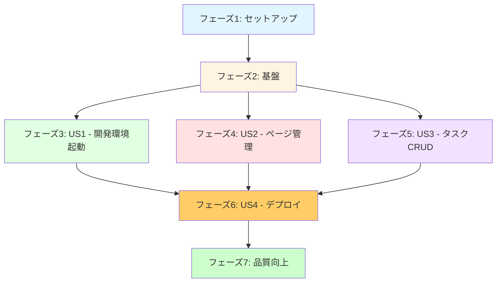
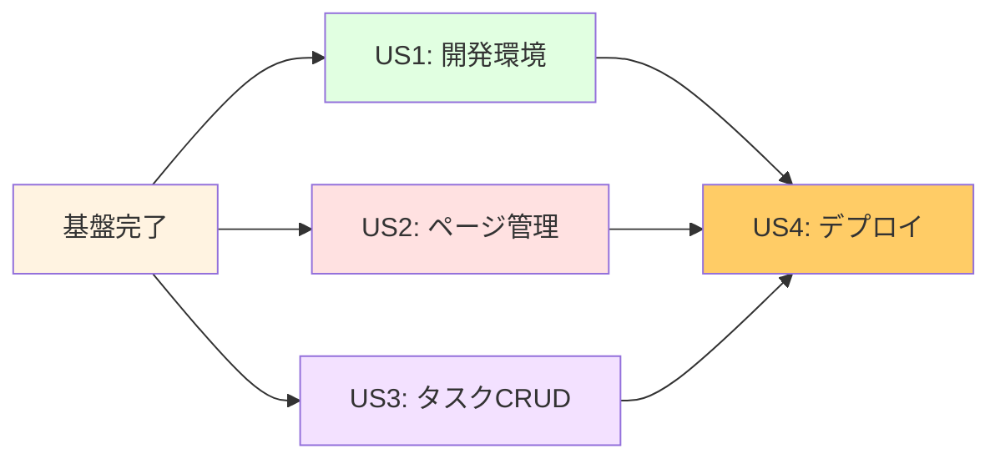
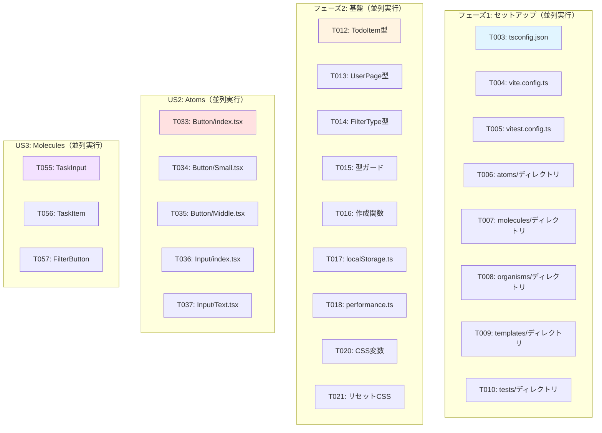
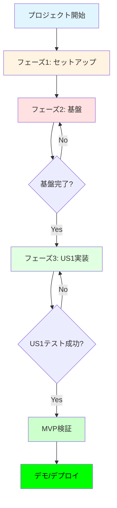
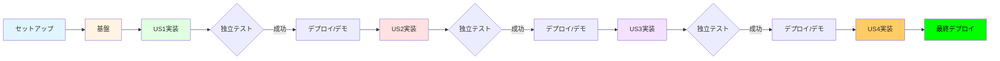
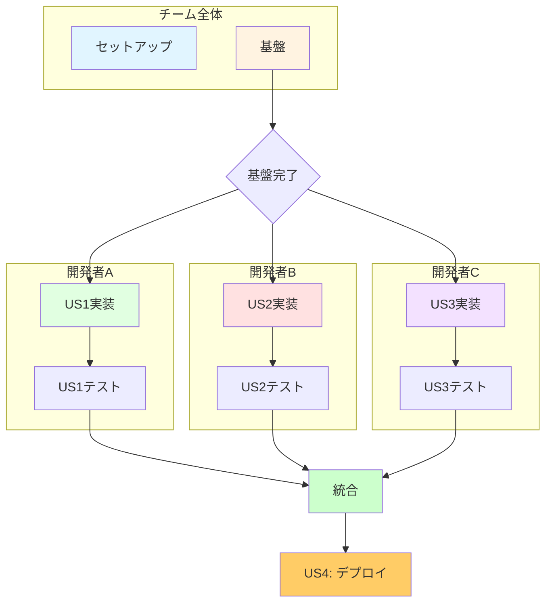
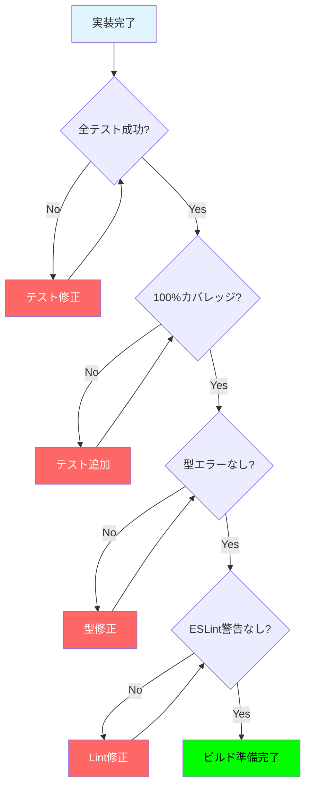
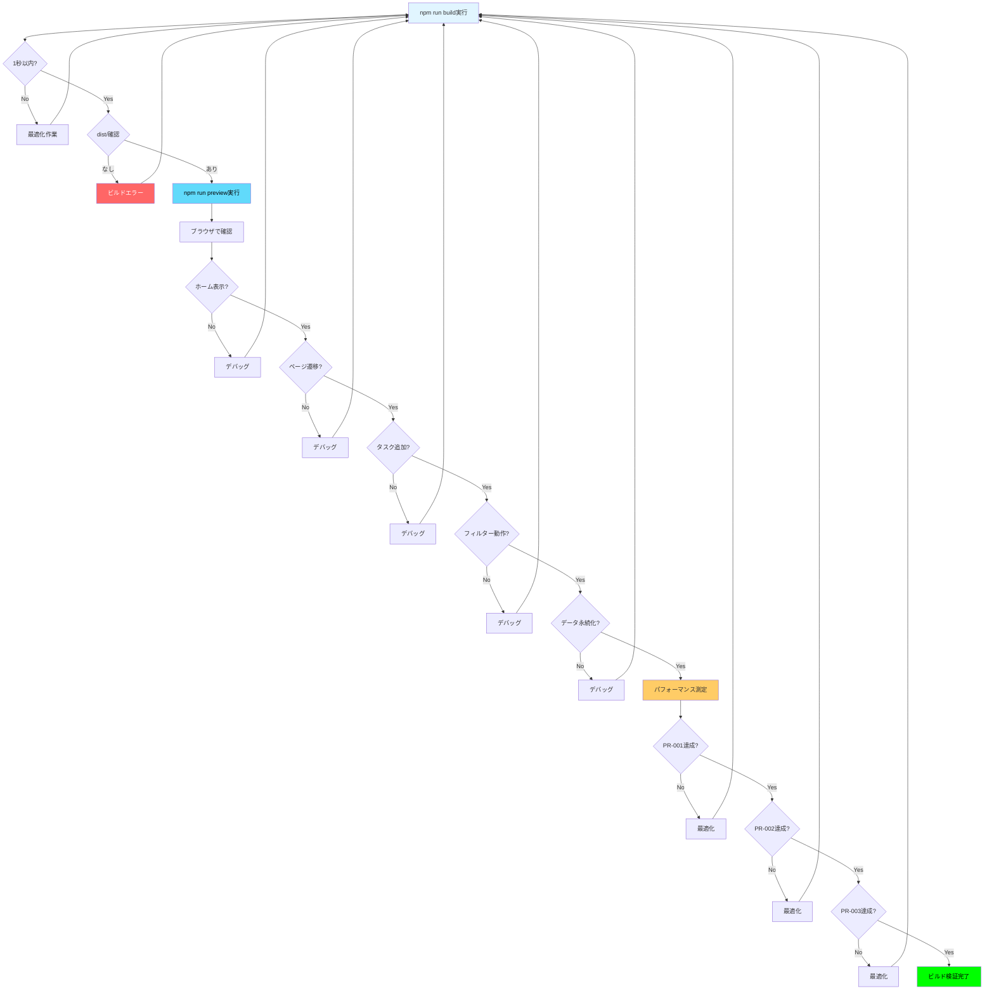
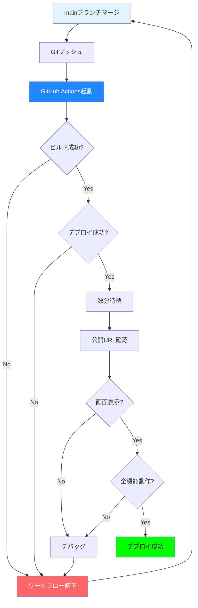

# タスク: 個人用Todoアプリケーション

**入力**: `/specs/001-ToDo/`のデザインドキュメント  
**前提条件**: plan.md（必須）、spec.md（ユーザーストーリー用に必須）、research.md、data-model.md、quickstart.md  
**ブランチ**: `feature/impl-001-ToDo`  
**作成日**: 2025-11-20

**テスト**: このプロジェクトはTDD（テスト駆動開発）を採用しており、すべての実装タスクの前にテストタスクを実施します。106テスト、100%カバレッジを目標としています。

**構成**: タスクはユーザーストーリーごとにグループ化され、各ストーリーの独立した実装とテストを可能にします。

## 形式: `- [ ] [ID] [P?] [Story?] 説明 in ファイルパス`

- **[P]**: 並列実行可能（異なるファイル、依存関係なし）
- **[Story]**: このタスクが属するユーザーストーリー（例: US1、US2、US3、US4）
- 説明に正確なファイルパスを含める

## プロジェクト構造

```
ToDo/
├── src/
│   ├── main.tsx                 # エントリーポイント
│   ├── App.tsx                  # ルートコンポーネント
│   ├── index.css                # グローバルスタイル
│   ├── vite-env.d.ts            # Vite型定義
│   ├── components/
│   │   ├── atoms/               # Atomic Design: 原子
│   │   │   ├── Button/
│   │   │   └── Input/
│   │   ├── molecules/           # Atomic Design: 分子
│   │   ├── organisms/           # Atomic Design: 生体
│   │   │   └── Sidebar.tsx
│   │   └── templates/           # Atomic Design: テンプレート
│   ├── pages/
│   │   ├── HomePage.tsx
│   │   ├── DynamicTodoPage.tsx
│   │   └── TestUserTodo.tsx
│   ├── config/
│   │   └── userPages.ts
│   ├── types/
│   │   └── todo.ts
│   └── utils/
│       ├── localStorage.ts
│       └── performance.ts
├── tests/
│   ├── setup.ts
│   ├── unit/
│   │   ├── components/
│   │   ├── config/
│   │   ├── types/
│   │   └── utils/
│   └── integration/
├── public/
├── dist/                        # ビルド出力
├── index.html
├── package.json
├── tsconfig.json
├── vite.config.ts
├── vitest.config.ts
└── start.ps1                    # ワンコマンド起動スクリプト
```

---

## フェーズ1: セットアップ（共有インフラストラクチャ）

**目的**: プロジェクトの初期化と基本構造の構築

### プロジェクト初期化

- [X] T001 実装計画（plan.md）に従ってプロジェクト構造を確認
- [X] T002 package.jsonの依存関係を検証（React 18.2.0, TypeScript 4.9.3, Vite 4.2.0等）
- [X] T003 [P] tsconfig.jsonの厳格モード設定を確認（strict: true）
- [X] T004 [P] vite.config.tsの設定を確認（ポート1234、HMR、プラグイン）
- [X] T005 [P] vitest.config.tsのテスト設定を確認（happy-dom、カバレッジ）

### 基本ディレクトリとファイル

- [X] T006 [P] src/components/atoms/ディレクトリ構造を確認
- [X] T007 [P] src/components/molecules/ディレクトリ構造を確認
- [X] T008 [P] src/components/organisms/ディレクトリ構造を確認
- [X] T009 [P] src/components/templates/ディレクトリ構造を確認
- [X] T010 [P] tests/unit/およびtests/integration/ディレクトリ構造を確認
- [X] T011 tests/setup.tsでテストセットアップを確認（Testing Library、happy-dom）

---

## フェーズ2: 基盤（ブロッキング前提条件）

**目的**: すべてのユーザーストーリーを実装する前に完了しなければならないコアインフラストラクチャ

**⚠️ 重要**: このフェーズが完了するまで、ユーザーストーリーの作業を開始できません

### コアデータ型定義

- [X] T012 [P] TodoItem型を定義 in src/types/todo.ts
- [X] T013 [P] UserPage型を定義 in src/types/todo.ts
- [X] T014 [P] FilterType型を定義 in src/types/todo.ts
- [X] T015 [P] 型ガード関数（isTodoItem, isValidTaskText等）を実装 in src/types/todo.ts
- [X] T016 [P] TodoItem作成関数（createTodoItem）を実装 in src/types/todo.ts

### コアユーティリティ関数

- [X] T017 [P] LocalStorageラッパー関数を実装 in src/utils/localStorage.ts
- [X] T018 [P] パフォーマンス測定ユーティリティを実装 in src/utils/performance.ts

### ユーザーページ設定

- [X] T019 userPages配列を定義（初期ページ: TestUser） in src/config/userPages.ts

### グローバルスタイル

- [X] T020 [P] グローバルCSS変数を定義（カラー、フォント、スペーシング） in src/index.css
- [X] T021 [P] リセットCSSとベーススタイルを実装 in src/index.css

### 基盤テスト

- [X] T022 [P] TodoItem型のテスト（型ガード、バリデーション、作成関数） in tests/unit/types/todo.test.ts
- [X] T023 [P] LocalStorageユーティリティのテスト in tests/unit/utils/localStorage.test.ts
- [X] T024 [P] パフォーマンスユーティリティのテスト in tests/unit/utils/performance.test.ts
- [X] T025 [P] userPages設定のテスト in tests/unit/config/userPages.test.ts

**チェックポイント**: 基盤が準備完了 - ユーザーストーリーの実装を並列で開始可能

---

## フェーズ3: ユーザーストーリー1 - ワンコマンド開発環境起動 (優先度: P1) 🎯 MVP

**目標**: 開発者が`.\start.ps1`を実行するだけで、npm依存関係の自動インストール、開発サーバーのバックグラウンド起動、ブラウザの自動オープンが実行される

**独立テスト**: 
1. `.\start.ps1`を実行
2. node_modules未存在時にnpm installが実行されることを確認
3. 開発サーバーがポート1234で起動することを確認
4. ブラウザで`http://localhost:1234`が自動的に開くことを確認
5. PowerShellウィンドウが5秒後に自動終了し、サーバーは継続実行することを確認

### ユーザーストーリー1のテスト（TDD）

> **注記: これらのテストを最初に記述し、実装前に失敗することを確認してください**

- [ ] T026 [P] [US1] start.ps1のユニットテスト（PowerShellテスト） in tests/unit/scripts/start.test.ps1
- [ ] T027 [P] [US1] 開発サーバー起動の統合テスト in tests/integration/dev-server-startup.test.tsx

### ユーザーストーリー1の実装

- [X] T028 [US1] start.ps1スクリプトを実装（node_modules存在確認、npm install、dev server起動、ブラウザオープン、自動終了） in start.ps1
- [X] T029 [US1] package.jsonのdevスクリプトを確認（vite --port 1234 --host） in package.json
- [X] T030 [US1] vite.config.tsでポート1234、HMR、自動ブラウザオープン設定を確認 in vite.config.ts

**チェックポイント**: この時点で、`.\start.ps1`が完全に機能し、開発環境が自動起動する

---

## フェーズ4: ユーザーストーリー2 - 個人用Todoページの作成と管理 (優先度: P1)

**目標**: ユーザーがUIから個人用Todoページを追加・編集・削除でき、各ページが独立したタスクデータを持つ

**独立テスト**:
1. サイドバーの「➕ 新規ページ追加」ボタンをクリック
2. ページ名（例: 「田中」）を入力して追加
3. サーバーを再起動
4. サイドバーに新しいページが表示され、クリックで開けることを確認
5. ページ名を編集し、サーバー再起動後に反映を確認
6. ページを削除し、サーバー再起動後に消えていることと、そのページのタスクデータも削除されていることを確認

### ユーザーストーリー2のテスト（TDD）

> **注記: これらのテストを最初に記述し、実装前に失敗することを確認してください**

- [ ] T031 [P] [US2] Sidebarコンポーネントのテスト in tests/unit/components/Sidebar.test.tsx
- [ ] T032 [P] [US2] 個人ページセットアップの統合テスト in tests/integration/personal-page-setup.test.tsx

### ユーザーストーリー2の実装

#### Atomsコンポーネント（ボタンと入力）

- [X] T033 [P] [US2] Buttonコンポーネント（基本） in src/components/atoms/Button/index.tsx
- [X] T034 [P] [US2] Smallボタンコンポーネント in src/components/atoms/Button/Small.tsx
- [X] T035 [P] [US2] Middleボタンコンポーネント in src/components/atoms/Button/Middle.tsx
- [X] T036 [P] [US2] Inputコンポーネント（基本） in src/components/atoms/Input/index.tsx
- [X] T037 [P] [US2] Textインプットコンポーネント in src/components/atoms/Input/Text.tsx

#### Atomsコンポーネントのテスト

- [ ] T038 [P] [US2] Buttonコンポーネントのテスト in tests/unit/components/atoms/Button.test.tsx
- [ ] T039 [P] [US2] Inputコンポーネントのテスト in tests/unit/components/atoms/Input.test.tsx

#### Organismsコンポーネント（サイドバー）

- [X] T040 [US2] Sidebarコンポーネントを実装（ページリスト表示、追加・編集・削除UI） in src/components/organisms/Sidebar.tsx

#### ページとルーティング

- [X] T041 [P] [US2] HomePageコンポーネントを実装 in src/pages/HomePage.tsx
- [X] T042 [P] [US2] DynamicTodoPageコンポーネントを実装（動的ルート:pageNameに対応） in src/pages/DynamicTodoPage.tsx
- [X] T043 [P] [US2] TestUserTodoページを実装 in src/pages/TestUserTodo.tsx
- [X] T044 [US2] App.tsxでReact Routerを設定（ホーム、動的ページ、テストページのルート定義） in src/App.tsx
- [X] T045 [US2] main.tsxでルーターをマウント in src/main.tsx

#### ページコンポーネントのテスト

- [ ] T046 [P] [US2] HomePageのテスト in tests/unit/components/HomePage.test.tsx
- [ ] T047 [P] [US2] DynamicTodoPageのテスト in tests/unit/components/DynamicTodoPage.test.tsx
- [ ] T048 [P] [US2] Appコンポーネントのテスト in tests/unit/components/App.test.tsx

**チェックポイント**: この時点で、ユーザーストーリー1とユーザーストーリー2が両方とも独立して機能する

---

## フェーズ5: ユーザーストーリー3 - タスクのCRUD操作とフィルタリング (優先度: P1)

**目標**: ユーザーが各個人用ページでタスクの追加、完了切り替え、個別削除、一括削除、フィルタリングを実行でき、すべての操作がLocalStorageに自動保存される

**独立テスト**:
1. タスクを入力してEnterキーまたは「➕ 追加」ボタンでタスクが追加されることを確認
2. チェックボックスをクリックして完了/未完了が切り替わることを確認
3. 🗑️ボタンでタスクが削除されることを確認
4. フィルター（すべて/進行中/完了済み）で表示が変わることを確認
5. 「完了タスクをクリア」ボタンで完了済みタスクが一括削除されることを確認
6. ページをリロードしても、タスクデータが保持されることを確認

### ユーザーストーリー3のテスト（TDD）

> **注記: これらのテストを最初に記述し、実装前に失敗することを確認してください**

- [ ] T049 [P] [US3] タスク操作の統合テスト（追加、完了切り替え） in tests/integration/task-operations.test.tsx
- [ ] T050 [P] [US3] タスクフィルタリングの統合テスト in tests/integration/task-filtering.test.tsx
- [ ] T051 [P] [US3] タスク削除の統合テスト in tests/integration/task-deletion.test.tsx
- [ ] T052 [P] [US3] 一括削除の統合テスト in tests/integration/bulk-deletion.test.tsx
- [ ] T053 [P] [US3] データ永続化の統合テスト in tests/integration/data-persistence.test.tsx
- [ ] T054 [P] [US3] エッジケースの統合テスト in tests/integration/edge-cases.test.tsx

### ユーザーストーリー3の実装

#### Moleculesコンポーネント（タスク関連）

- [ ] T055 [P] [US3] TaskInputコンポーネントを実装（タスク入力フォーム、Enter/追加ボタン対応） in src/components/molecules/TaskInput.tsx
- [ ] T056 [P] [US3] TaskItemコンポーネントを実装（タスク表示、チェックボックス、削除ボタン） in src/components/molecules/TaskItem.tsx
- [ ] T057 [P] [US3] FilterButtonコンポーネントを実装（フィルターボタン、タスク数表示） in src/components/molecules/FilterButton.tsx

#### Moleculesコンポーネントのテスト

- [ ] T058 [P] [US3] TaskInputのテスト in tests/unit/components/TaskInput.test.tsx
- [ ] T059 [P] [US3] TaskItemのテスト in tests/unit/components/TaskItem.test.tsx
- [ ] T060 [P] [US3] FilterButtonのテスト in tests/unit/components/FilterButton.test.tsx

#### Organismsコンポーネント（タスクリストとフィルターバー）

- [ ] T061 [P] [US3] TaskListコンポーネントを実装（タスクリスト表示、完了タスククリアボタン） in src/components/organisms/TaskList.tsx
- [ ] T062 [P] [US3] FilterBarコンポーネントを実装（すべて/進行中/完了済みフィルター） in src/components/organisms/FilterBar.tsx

#### Organismsコンポーネントのテスト

- [ ] T063 [P] [US3] TaskListのテスト in tests/unit/components/TaskList.test.tsx
- [ ] T064 [P] [US3] FilterBarのテスト in tests/unit/components/FilterBar.test.tsx

#### DynamicTodoPageへの統合

- [ ] T065 [US3] DynamicTodoPageでTaskInput、TaskList、FilterBarを統合 in src/pages/DynamicTodoPage.tsx
- [ ] T066 [US3] DynamicTodoPageでLocalStorageユーティリティを使用してデータ永続化を実装 in src/pages/DynamicTodoPage.tsx
- [ ] T067 [US3] DynamicTodoPageでReact Hooks（useState、useEffect）を使用して状態管理を実装 in src/pages/DynamicTodoPage.tsx

#### パフォーマンス最適化

- [ ] T068 [P] [US3] React.memoでTaskItemコンポーネントを最適化 in src/components/molecules/TaskItem.tsx
- [ ] T069 [P] [US3] useMemoでフィルタリングロジックを最適化 in src/pages/DynamicTodoPage.tsx
- [ ] T070 [P] [US3] useCallbackでイベントハンドラーを最適化 in src/pages/DynamicTodoPage.tsx

**チェックポイント**: すべてのコアユーザーストーリー（US1、US2、US3）が独立して機能する

---

## フェーズ6: ユーザーストーリー4 - GitHub Pagesへのデプロイ (優先度: P2)

**目標**: 開発者がビルドコマンドを実行し、生成された静的ファイルをGitHub Pagesにデプロイして公開できる

**独立テスト**:
1. `npm run build`を実行し、distフォルダが生成されることを確認
2. `npm run preview`でビルド結果をローカルプレビュー
3. GitHub Actionsワークフローが正常に動作し、GitHub Pagesにデプロイされることを確認
4. デプロイ後のURLでアプリケーションが正常に動作することを確認

### ユーザーストーリー4の実装

#### ビルド設定

- [X] T071 [P] [US4] vite.config.tsでプロダクションビルド設定を確認（base path、最適化） in vite.config.ts
- [X] T072 [P] [US4] package.jsonのbuildスクリプトを確認（tsc && vite build） in package.json
- [X] T073 [P] [US4] package.jsonのpreviewスクリプトを確認（vite preview） in package.json

#### GitHub Actions CI/CD

- [X] T074 [US4] GitHub Actionsワークフローファイルを作成（main→gh-pagesデプロイ） in .github/workflows/deploy.yml
- [ ] T075 [US4] GitHub Pagesの設定を確認（gh-pagesブランチからデプロイ）

#### ビルド検証

- [X] T076 [US4] ローカルビルドテスト（`npm run build`で1秒以内に完了することを確認）
- [X] T077 [US4] プレビュー確認（`npm run preview`で画面表示を確認）
- [ ] T078 [US4] 全機能の動作検証（タスク追加・削除・完了・フィルター）
- [ ] T079 [US4] パフォーマンス測定（DevToolsでPR-001～PR-005を検証）

#### デプロイ検証

- [ ] T080 [US4] mainブランチへマージ
- [ ] T081 [US4] GitHub Actions自動デプロイ確認
- [ ] T082 [US4] 本番URLで最終動作確認

**チェックポイント**: すべてのユーザーストーリーが完了し、本番環境にデプロイ済み

---

## フェーズ7: 品質向上と横断的関心事

**目的**: 複数のユーザーストーリーに影響する改善

### ドキュメント

- [ ] T083 [P] README.mdを更新（セットアップ手順、使用方法、デプロイ手順） in README.md
- [ ] T084 [P] quickstart.mdの検証（手順通りに環境構築できることを確認） in specs/feature/impl-001-ToDo/quickstart.md

### コード品質

- [ ] T085 [P] ESLintとPrettierの設定を確認し、全ファイルにフォーマット適用
- [ ] T086 [P] TypeScript strict modeの警告をすべて解消
- [ ] T087 コンポーネントのリファクタリング（重複コード削除、命名改善）

### パフォーマンス最適化

- [ ] T088 [P] コード分割（React.lazyとSuspense）を実装してバンドルサイズを削減
- [ ] T089 [P] 画像とアセットの最適化
- [ ] T090 Lighthouse監査を実行し、Performance 90+を達成

### セキュリティ強化

- [ ] T091 [P] HTMLエスケープ処理の検証（XSS対策）
- [ ] T092 [P] LocalStorageエラーハンドリングの強化

### テストカバレッジ

- [ ] T093 テストカバレッジレポートを生成（`npm run test:coverage`）
- [ ] T094 100%カバレッジ達成（未カバー部分のテスト追加）

### 最終検証

- [ ] T095 全テストが成功することを確認（`npm run test`）
- [ ] T096 全パフォーマンス基準（PR-001～PR-005）を達成していることを確認
- [ ] T097 全機能要件（FR-001～FR-038）を満たしていることを確認
- [ ] T098 全セキュリティ要件（SR-001～SR-002）を満たしていることを確認
- [ ] T099 全アクセシビリティ要件（AR-001～AR-004）を満たしていることを確認
- [ ] T100 憲法v1.0.0のすべての原則に準拠していることを確認

---

## 依存関係と実行順序

### フェーズ依存関係



**依存関係の説明**:
- **セットアップ（フェーズ1）**: 依存関係なし - 即座に開始可能
- **基盤（フェーズ2）**: セットアップ完了に依存 - すべてのユーザーストーリーをブロック
- **ユーザーストーリー（フェーズ3-5）**: 基盤完了に依存
  - US1、US2、US3は並列実装可能（スタッフがいる場合）
  - または優先度順に順次実装（P1 → P1 → P1）
- **デプロイ（フェーズ6）**: US1、US2、US3のすべて完了に依存
- **品質向上（フェーズ7）**: デプロイ完了に依存

### ユーザーストーリー依存関係



- **ユーザーストーリー1（P1）**: 基盤完了後に開始可能 - 他ストーリーへの依存なし
- **ユーザーストーリー2（P1）**: 基盤完了後に開始可能 - US3と統合するが独立してテスト可能
- **ユーザーストーリー3（P1）**: 基盤完了後に開始可能 - US2と統合するが独立してテスト可能
- **ユーザーストーリー4（P2）**: US1、US2、US3のすべて完了に依存

### 各ユーザーストーリー内の順序

**ユーザーストーリー内のワークフロー**:
1. テスト作成（TDD） - 実装前に失敗することを確認
2. Atomsコンポーネント実装（並列実行可能）
3. Moleculesコンポーネント実装（Atoms完了後）
4. Organismsコンポーネント実装（Molecules完了後）
5. Pagesコンポーネント実装（Organisms完了後）
6. 統合とテスト
7. ストーリー完了前に次の優先度へ移行

### 並列実行の機会



- セットアップフェーズ: T003～T010は並列実行可能（[P]マーク）
- 基盤フェーズ: T012～T021は並列実行可能（[P]マーク）
- ユーザーストーリー2: Atomsコンポーネント（T033～T037）は並列実行可能
- ユーザーストーリー3: Moleculesコンポーネント（T055～T057）は並列実行可能
- 基盤完了後: US1、US2、US3は並列実行可能（チーム容量がある場合）

---

## 並列実行例: ユーザーストーリー3

```bash
# ユーザーストーリー3のすべてのテストを一緒に起動（TDD）:
並列タスク: "タスク操作の統合テスト in tests/integration/task-operations.test.tsx"
並列タスク: "タスクフィルタリングの統合テスト in tests/integration/task-filtering.test.tsx"
並列タスク: "タスク削除の統合テスト in tests/integration/task-deletion.test.tsx"
並列タスク: "一括削除の統合テスト in tests/integration/bulk-deletion.test.tsx"
並列タスク: "データ永続化の統合テスト in tests/integration/data-persistence.test.tsx"
並列タスク: "エッジケースの統合テスト in tests/integration/edge-cases.test.tsx"

# ユーザーストーリー3のすべてのMoleculesを一緒に起動:
並列タスク: "TaskInputコンポーネントを実装 in src/components/molecules/TaskInput.tsx"
並列タスク: "TaskItemコンポーネントを実装 in src/components/molecules/TaskItem.tsx"
並列タスク: "FilterButtonコンポーネントを実装 in src/components/molecules/FilterButton.tsx"
```

---

## 実装戦略

### MVP優先（ユーザーストーリー1のみ）



1. フェーズ1完了: セットアップ
2. フェーズ2完了: 基盤（重要 - すべてのストーリーをブロック）
3. フェーズ3完了: ユーザーストーリー1
4. **停止して検証**: ユーザーストーリー1を独立してテスト
5. 準備ができたらデプロイ/デモ

### 段階的デリバリー



1. セットアップ + 基盤完了 → 基盤準備完了
2. ユーザーストーリー1追加 → 独立してテスト → デプロイ/デモ（MVP!）
3. ユーザーストーリー2追加 → 独立してテスト → デプロイ/デモ
4. ユーザーストーリー3追加 → 独立してテスト → デプロイ/デモ
5. ユーザーストーリー4追加 → 最終デプロイ
6. 各ストーリーが前のストーリーを壊さずに価値を追加

### 並列チーム戦略



複数の開発者がいる場合:

1. チームがセットアップ + 基盤を一緒に完了
2. 基盤完了後:
   - 開発者A: ユーザーストーリー1
   - 開発者B: ユーザーストーリー2
   - 開発者C: ユーザーストーリー3
3. ストーリーが完了し、独立して統合

---

## ビルド検証ワークフロー

### ビルド前チェックリスト



**ビルド前に確認**:
- [ ] すべてのテストが成功（`npm run test`）
- [ ] テストカバレッジ100%（`npm run test:coverage`）
- [ ] TypeScript型エラーなし（`npm run type-check`）
- [ ] ESLint警告なし（`npm run lint`）

### ビルド検証手順



**詳細ステップ**:

1. **ビルド実行**:
   ```powershell
   npm run build
   ```
   - 1秒以内に完了することを確認（PR-005）
   - dist/フォルダが生成されることを確認

2. **プレビュー起動**:
   ```powershell
   npm run preview
   ```
   - ローカルサーバーが起動することを確認

3. **機能検証**:
   - [ ] ホームページが表示される
   - [ ] サイドバーからページ遷移が動作する
   - [ ] タスク追加が動作する
   - [ ] タスク完了切り替えが動作する
   - [ ] タスク削除が動作する
   - [ ] フィルター切り替えが動作する
   - [ ] ページリロード後にデータが保持される

4. **パフォーマンス測定**:
   - [ ] PR-001: 初期ロード2秒以内（Chrome DevTools Performance タブ）
   - [ ] PR-002: タスク操作UI反映100ms以内
   - [ ] PR-003: フィルター切り替え50ms以内

5. **Lighthouse監査**:
   ```powershell
   # Chrome DevToolsでLighthouseを実行
   ```
   - Performance: 90+
   - Accessibility: 90+
   - Best Practices: 90+
   - SEO: 90+

### デプロイ検証手順



**詳細ステップ**:

1. **GitHub Actions確認**:
   - リポジトリの「Actions」タブでワークフロー実行状況を確認
   - ビルドとデプロイが成功していることを確認

2. **公開URL確認**:
   - `https://<username>.github.io/<repository>/`にアクセス
   - アプリケーションが正常に表示されることを確認

3. **本番環境での機能検証**:
   - [ ] すべての機能がローカルと同様に動作する
   - [ ] ルーティングが正常に動作する
   - [ ] LocalStorageが正常に動作する
   - [ ] パフォーマンス基準を満たしている

---

## パフォーマンス基準の測定方法

### PR-001: 初期ロード2秒以内

**測定手順**:
1. Chrome DevToolsを開く（F12）
2. 「Performance」タブを選択
3. 「Record」ボタンをクリック
4. ページをリロード（Ctrl+R）
5. ページが完全に表示されたら「Stop」ボタンをクリック
6. タイムラインで「DOMContentLoaded」から「Load」までの時間を確認

**合格基準**: 2秒以内

### PR-002: タスク操作UI反映100ms以内

**測定手順**:
1. Chrome DevToolsの「Performance」タブで「Record」開始
2. タスクを追加（Enterキー押下）
3. 「Stop」ボタンをクリック
4. イベントハンドラー実行からUI更新までの時間を確認

**合格基準**: 100ms以内

### PR-003: フィルター切り替え50ms以内

**測定手順**:
1. Chrome DevToolsの「Performance」タブで「Record」開始
2. フィルターボタンをクリック
3. 「Stop」ボタンをクリック
4. クリックイベントからUI更新までの時間を確認

**合格基準**: 50ms以内

### PR-004: 開発サーバー起動30秒以内

**測定手順**:
1. PowerShellで`.\start.ps1`を実行
2. ブラウザが開くまでの時間を計測

**合格基準**: 30秒以内

### PR-005: ビルド時間1秒以内

**測定手順**:
1. PowerShellで`npm run build`を実行
2. 開始から完了までの時間を確認

**合格基準**: 1秒以内

---

## 注意事項

- **[P]タスク** = 異なるファイル、依存関係なし
- **[Story]ラベル** = トレーサビリティのため、タスクを特定のユーザーストーリーにマッピング
- 各ユーザーストーリーは独立して完了・テスト可能であるべき
- 実装前にテストが失敗することを確認
- 各タスクまたは論理グループの後にコミット
- 各チェックポイントで停止し、ストーリーを独立して検証
- 避けるべき: 曖昧なタスク、同じファイルの競合、ストーリーの独立性を壊すクロスストーリー依存関係

---

## タスク進捗トラッキング

**合計タスク数**: 100タスク

| フェーズ | タスク数 | 状態 |
|---------|---------|------|
| フェーズ1: セットアップ | 11 | 未着手 |
| フェーズ2: 基盤 | 14 | 未着手 |
| フェーズ3: US1 - 開発環境起動 | 5 | 未着手 |
| フェーズ4: US2 - ページ管理 | 18 | 未着手 |
| フェーズ5: US3 - タスクCRUD | 22 | 未着手 |
| フェーズ6: US4 - デプロイ | 12 | 未着手 |
| フェーズ7: 品質向上 | 18 | 未着手 |

**並列実行機会**:
- フェーズ1: 8タスク並列実行可能
- フェーズ2: 11タスク並列実行可能
- ユーザーストーリー2: 5タスク並列実行可能（Atoms）
- ユーザーストーリー3: 6タスク並列実行可能（テスト）、3タスク並列実行可能（Molecules）

**推奨MVPスコープ**: フェーズ1 + フェーズ2 + フェーズ3（ユーザーストーリー1のみ）
